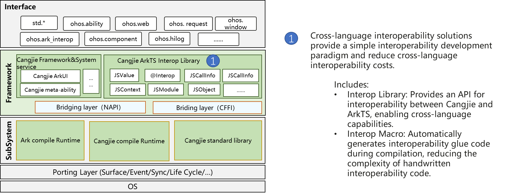
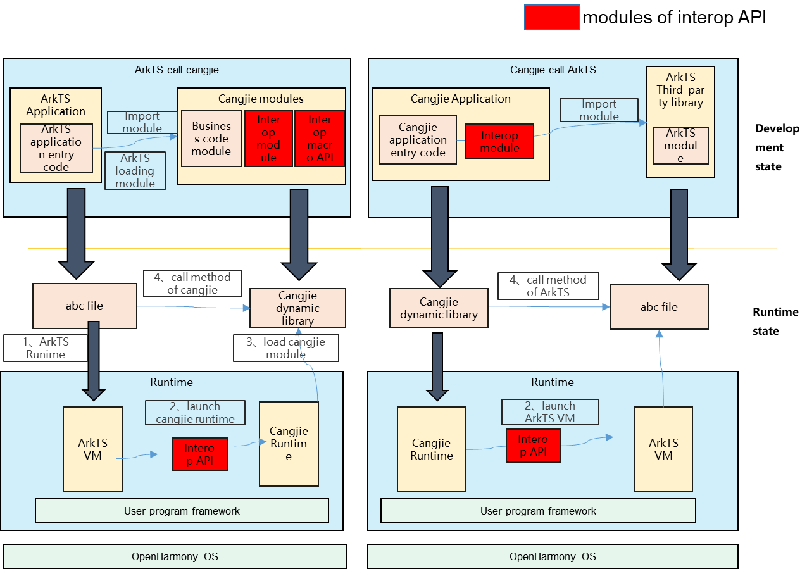

# Cangjie Interop API Public Repository

## Introduction

The Cangjie ArkTS Interop Library API is used to provide cross-language interoperability between Cangjie and ArkTS, includes the common interfaces, interop macro interfaces, and JSON and CFFI interfaces provided by the Cangjie Interop Library, hoping to provide developers with cross-language interop solutions that take into account both development efficiency and operational efficiency, provide a simple interop development paradigm, and reduce cross-language interop overhead.The overall structure is shown below.

Framework architecture:


** Architecture Description **

For interop scenarios, Cangjie provides ark_interop libraries to achieve interop with ArkTS. 

- The library mainly provides the following types of mappings.

    | **Cangjie type**                                                 | **Cangjie Interop type** | **ArkTS  Typ** |
    | ------------------------------------------------------------ | -------------------- | --------------- |
    | Unit                                                         | JSUndefined          | undefined       |
    | NA                                                           | JSNull               | null            |
    | Bool                                                         | JSBoolean            | boolean         |
    | Int8、Int16、Int32、Int64、UInt8、UInt16、UInt32、UInt64、Float16、Float32、Float64 | JSNumber             | number          |
    | String                                                       | JSString             | string          |
    | class、interface                                             | JSObject             | object          |
    | Array                                                        | JSArray              | Array           |
    | BigInt                                                       | JSBigInt             | bigint          |
    | func                                                         | JSFunction           | function        |
    | NA                                                           | JSSymbol             | symbol          |

- The library also provides the following key data structures:

    - JSValue: It is used to represent objects (such as numbers, strings, objects, functions) from ArkTS, which is a bridge between Cangjie and ArkTS type conversion;
    - JSModule: The goal of JSModule is to provide symbol export capabilities (exporting to ArkTS). Together with a custom static initialisation function, it registers the export targets in the global table when the dynamic library is loaded, to be executed by the ArkTS engine.
    - JSRuntime: The ArkTS runtime created by Cangjie.
    - JSContext: Used to represent context interoperable with ArkTS, providing module loading, JSValue creation, and more;
    - JSCallInfo: Used to represent a set of parameters that are called when an ArkTS interop call occurs;

- The library completes the interoperability function by calling the interface provided by the ArkTS virtual machine and napi through CFFI.

Note: The currently open Cangjie Interop interface only supports standard devices.

## Public ability

This repository also provides interfaces for public capabilities, such as: JSON serialisation and deserialisation interfaces, C language interoperability interfaces, general exception interfaces, callback interfaces, and API level interfaces.

- JSON serialisation and deserialisation interfaces:Used for processing JSON data, achieving mutual conversion between String, JsonValue, and DataModel.
- C language interoperability interfaces:Provides a utility class for managing C interoperability objects.
- general exception interfaces:A general exception class BusinessException.
- callback interfaces:A utility class for function callback parameters.
- API level interfaces:Provides an API Level interface for obtaining the current API Level.

## Directory

```text
arkcompiler/cangjie_ark_interop
├── ohos                    # Cangjie interoperability API and public repository code
|    ├── ark_interop        # Cangjie Interop API
|    ├── ark_interop_helper # Cangjie Interop library utility class
|    ├── ark_interop_macro  # Cangjie Interop macro
|    ├── business_exception # Cangjie public exception
|    ├── callback_invoke    # Cagnejie public callback invoke
|    ├── encoding           # Cangjie public json encoding
|    ├── ffi                # Cangjie public C FFI Library
|    ├── labels             # Cangjie public Interop Labels
|    ├── utf16string        # Cangjie UTF16 String
├── doc                    # Cangjie documentation including API reference, development guide and user manual
|    ├── API_Reference      # Cangjie api reference
|    ├── Dev_Guide          # Cangjie developer guide
|    ├── release-notes      # Cangjie release notes
|    ├── User_Manual        # Cangjie user manual
├── figures                # Images used in the README
├── test                   # Cangjie interop testcases
```

## Constraints


## Usage Scenarios

It contains the Cangjie-ArkTS interoperation library, which is used for Cangjie-ArkTS interoperation. The json library/APILevel/cffi library are basic function libraries, providing public capabilities for subsystems such as Cangjie API/Cangjie UI.

### Typical scenario one: ArkTS calls Cangjie

For the demands of scenario one, an interoperability library can be used to implement an interface that can be interoperable and invoked on the Cangjie side. The example is as follows:

In OpenHarmony application development, there is a demand for hybrid development of Cangjie and ArkTS, such as the following scenarios:

- Scenario one: When using ArkTS for development, the code modules developed by Cangjie are called through cross-language interop to give full play to Cangjie's high performance and high concurrency advantages and improve the application performance experience.

For more detailed examples, please refer to[Loading Cangjie Modules in ArkTS](https://gitcode.com/openharmony-sig/arkcompiler_cangjie_ark_interop/blob/master/doc/User_Manual/source_en/FFI/cangjie-arkts/arkts_import_cangjie.md)

- Scenario two: When using Cangjie for development, call the ArkTS library through cross-language interoperability to reuse the rich library ecosystem of ArkTS.

For more detailed examples, please refer to[Using ArkTS Modules in Cangjie Applications](https://gitcode.com/openharmony-sig/arkcompiler_cangjie_ark_interop/blob/master/doc/User_Manual/source_en/FFI/cangjie-arkts/using_arkts_module.md)

At the same time, in response to the development complexity brought about by interop, Cangjie provides a declarative interoperability macro ark_interop_macro, which allows developers to use the macro "@Interop[ArkTS]" to mark the functions or types that need to be exported to ArkTS in the Cangjie code, and automatically generate the interoperability "glue layer" code and ArkTS interface declarations during the compilation stage, reducing the complexity of the developer's handwritten interoperability code.

For more detailed examples, please refer to[Cangjie-ArkTS Declarative Interop Macros](https://gitcode.com/openharmony-sig/arkcompiler_cangjie_ark_interop/blob/master/doc/User_Manual/source_en/FFI/cangjie-arkts/interoperability_macro.md)



Module Description:

- Interop Libraries: Developers can call APIs provided by Interop to achieve cross-language parameter passing, function calling, and other capabilities.
- Interop macros: Developers use interoperability macros to mark Cangjie interfaces that need to be called by ArkTS code, and can automatically generate interop "glue" code and ArkTS interface declarations.

## Developer Document

[API Document](https://gitcode.com/openharmony-sig/arkcompiler_cangjie_ark_interop/blob/master/doc/API_Reference/source_zh_cn/arkinterop/cj-apis-ark_interop.md)

[Develop Guide](hhttps://gitcode.com/openharmony-sig/arkcompiler_cangjie_ark_interop/blob/master/doc/Dev_Guide/summary_cjnative_ohos.md)

## Code Contribution

Developers are welcome to contribute code, documentation, etc. For specific contribution processes and methods, please refer to [Code Contribution](https://gitcode.com/openharmony/docs/blob/master/en/contribute/code-contribution.md).

## Related Repositories

[arkui_napi](https://gitee.com/openharmony/arkui_napi)

[ability_runtime](https://gitee.com/openharmony/ability_ability_runtime)
