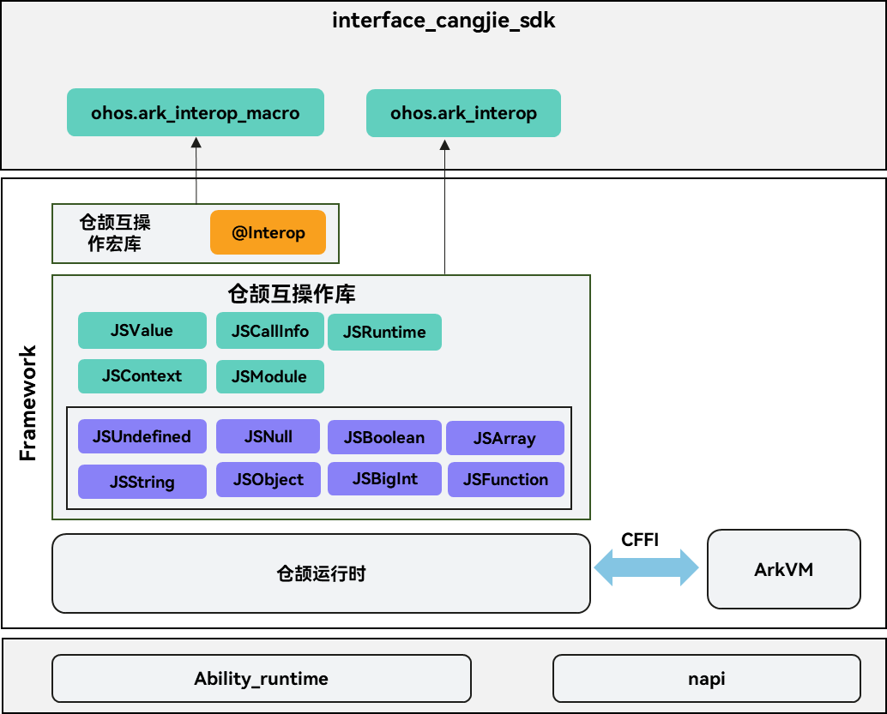
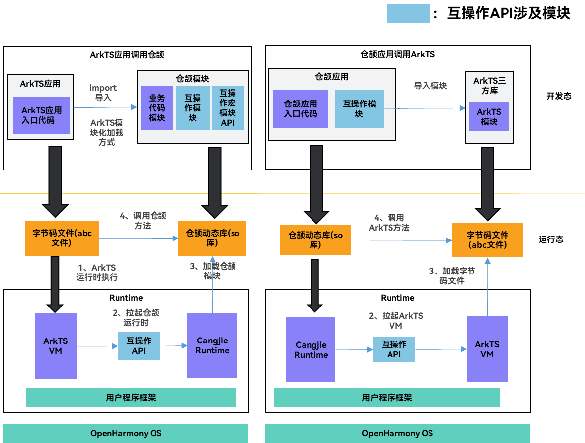

# 仓颉互操作API公共仓

## 简介

仓颉ArkTS互操作库API，用于提供仓颉与ArkTS跨语言互操作能力，包含仓颉互操作库提供的公共接口、互操作宏接口和依赖的json和CFFI接口，期望给开发者提供兼顾开发效率和运行效率的跨语言互操作解决方案，提供简洁的互操作开发范式，降低跨语言互通开销。

其主要结构如下图所示：



针对互操作场景诉求，仓颉提供ark_interop互操作库来实现与ArkTS的互操作。本库主要提供以下类型映射：

| **仓颉类型**                                                 | **仓颉互操作库类型** | **ArkTS  类型** |
| ------------------------------------------------------------ | -------------------- | --------------- |
| Unit                                                         | JSUndefined          | undefined       |
| 无                                                           | JSNull               | null            |
| Bool                                                         | JSBoolean            | boolean         |
| Int8、Int16、Int32、Int64、UInt8、UInt16、UInt32、UInt64、Float16、Float32、Float64 | JSNumber             | number          |
| String                                                       | JSString             | string          |
| class、interface                                             | JSObject             | object          |
| Array                                                        | JSArray              | Array           |
| BigInt                                                       | JSBigInt             | bigint          |
| func                                                         | JSFunction           | function        |
| 无                                                           | JSSymbol             | symbol          |

本库还提供以下的关键数据结构：

- JSValue: 用于表示来自ArkTS中的对象（如数字、字符串、对象、函数），是仓颉与ArkTS类型转换的桥梁。
- JSContext: 用于表示与ArkTS互操作的上下文，提供模块加载、JSValue创建等能力。
- JSCallInfo: 用于表示当发生来自于ArkTS互操作调用时 调用的参数集合。

最后本互操作库通过CFFI调用ArkTS虚拟机提供的接口完成互操作功能。

## 目录

```text
arkcompiler/cangjie_ark_interop
├── ohos                 # 仓颉互操作API的公共仓代码
├── doc                  # 仓颉文档，包括API参考、应用开发指南、仓颉编程语言用户手册
    ├── API_Reference    # 仓颉API参考
    └── Dev_Guide        # 仓颉开发指南
    └── release-notes    # 仓颉发布说明
    └── User_Manual      # 仓颉用户手册
├── figures              # 本README需要使用的图片
├── test                 # 仓颉互操作测试用例
```

## 约束

当前开放的仓颉互操作接口仅支持standard设备。

## 使用场景

包含仓颉-ArkTS互操作库，用于仓颉-ArkTS互操作。json库/APILevel/CFFI库为基础功能库，提供给仓颉API/仓颉UI等子系统等公共能力。

在OpenHarmony应用开发中，存在使用仓颉与ArkTS混合开发的诉求，例如以下场景：

- 场景一：在使用ArkTS开发时，通过跨语言互操作调用仓颉开发的代码模块，发挥仓颉高性能高并发优势，提升应用性能体验；

- 场景二：在使用仓颉开发时，通过跨语言互操作调用ArkTS库，复用ArkTS丰富的库生态；

同时针对互操作带来的开发复杂度，仓颉提供声明式互操作宏ark_interop_macro，使开发者可以使用宏“@Interop[ArkTS]”标注仓颉代码中需要导出给ArkTS使用的函数或类型，在编译阶段自动生成互操作“胶水层”代码及ArkTS接口声明，减少开发者手写互操作代码的复杂度。



模块说明：

- 互操作库：开发者通过调用互操作提供的API，实现跨语言参数传递、函数调用等能力。
- 互操作宏：开发者使用互操作宏来标注需要被ArkTS代码调用的仓颉接口，能够自动生成互操作“胶水”代码及ArkTS接口声明。

## 开发者文档

[API文档](https://gitcode.com/openharmony-sig/arkcompiler_cangjie_ark_interop/blob/master/doc/API_Reference/source_zh_cn/arkinterop/cj-apis-ark_interop.md)

[开发指南](https://gitcode.com/openharmony-sig/arkcompiler_cangjie_ark_interop/blob/master/doc/Dev_Guide/summary_cjnative_ohos.md)

## 参与贡献

欢迎广大开发者贡献代码、文档等，具体的贡献流程和方式请参见[参与贡献](https://gitcode.com/openharmony/docs/blob/master/zh-cn/contribute/%E5%8F%82%E4%B8%8E%E8%B4%A1%E7%8C%AE.md)。

## 相关仓

[arkui_napi](https://gitee.com/openharmony/arkui_napi)
