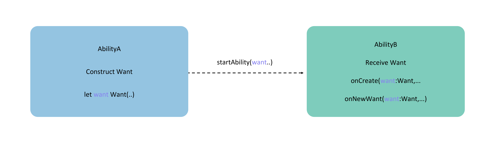

# Overview of Want

## Definition and Usage of Want

[Want](../../../API_Reference/source_en/apis/AbilityKit/cj-apis-ability.md#class-want) is an object used to transfer information between application components.

One common usage scenario is as a parameter for the [startAbility()](../../../API_Reference/source_en/apis/AbilityKit/cj-apis-ability.md#func-startabilitywant) method. For example, when UIAbilityA needs to start UIAbilityB and pass some data to UIAbilityB, Want can serve as a carrier to transfer the data to UIAbilityB.

**Figure 1** Illustration of Want Usage

<!-- ToBeReviewd -->

## Types of Want

- **Explicit Want**: When starting a target application component, if the caller specifies the abilityName and bundleName in the [Want](../../../API_Reference/source_en/apis/AbilityKit/cj-apis-ability.md#class-want) parameter, it is called an Explicit Want.

    Explicit Want is typically used for launching components within the same application. It starts the target component within the application by specifying the bundleName and abilityName in the Want object. When there is a clear target object to handle the request, Explicit Want is a simple and effective way to start the target application component.

  <!-- compile -->

  ```cangjie
  import kit.AbilityKit.Want

  let wantInfo = Want(deviceId: "", bundleName: "com.example.myapplication", abilityName: "FuncAbility")
  ```

- **Implicit Want**: When starting a target application component, if the caller does not specify the abilityName in the [Want](../../../API_Reference/source_en/apis/AbilityKit/cj-apis-ability.md#class-want) parameter, it is called an Implicit Want.

    When the target object to handle the request is unclear, Implicit Want can be used to leverage a capability provided by other applications within the current application, without needing to know which specific application provides that capability. Implicit Want uses the [skills tag](../cj-start/basic-knowledge/module-configuration-file.md#skills-tag) to define the required capability, and the system matches all applications that declare support for the request to handle it. For example, when a request to open a link is made, the system will match all applications that declare support for such requests and let the user choose which application to use for opening the link.

  <!-- compile -->

  ```cangjie
  import kit.AbilityKit.Want

  // uncomment line below if wish to implicitly query only in the specific bundle.
  // bundleName: 'com.example.myapplication'
  let wantInfo = Want(action: "ohos.want.action.search",
      // entities can be omitted
      entities: ["entity.system.browsable"],
      uri: "https://www.test.com:8080/query/student",
      `type`: "text/plain")
  ```

    > **Note:**
    >
    > Depending on the matching results of target application components in the system, the following three scenarios may occur when using Implicit Want to start an application component.
    >
    > - No matching application component is found: The startup fails.
    > - One matching application component is found: The component is started directly.
    > - Multiple matching application components are found ([UIAbility](../../../API_Reference/source_en/apis/AbilityKit/cj-apis-ability.md#class-uiability)): A selection dialog pops up for the user to choose.