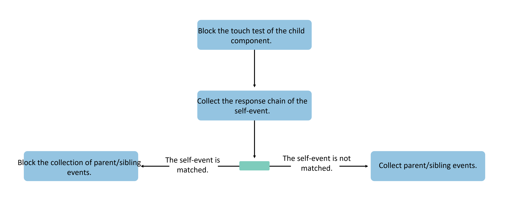

# Event Distribution

## Overview

Event distribution refers to the process where ArkUI receives touch events generated by user operations, performs touch testing, and distributes the touch events to various components to form events.

Touch events serve as input for touch testing and can be categorized into Touch-type touch events and Mouse-type touch events based on different user interaction methods.

- **Touch-type touch events** refer to touch events generated by touch interactions. Input sources include: finger (sliding on the screen), pen (stylus sliding on the screen), mouse (mouse operations), and touchpad (touchpad operations). These can trigger touch events, click events, drag events, and gesture events.

- **Mouse-type touch events** refer to touch events generated by mouse operations. Input sources include: mouse (mouse operations), touchpad (touchpad operations), and joystick (joystick operations). These can trigger touch events, click events, drag events, gesture events, and mouse events.

Regardless of whether they are Touch-type or Mouse-type touch events, the final triggered events are determined by touch testing to identify the component to which they will be distributed. Touch testing determines the generation of the ArkUI event response chain, the distribution of touch events, and the triggering of component-bound events.

## Touch Testing

Touch testing refers to the process where ArkUI receives the initial event of a Touch-type or Mouse-type touch event (e.g., an event generated when a finger or mouse cursor is pressed) and performs component response area testing and event response chain collection based on the coordinates of the received event.

Developers can influence the touch testing process by setting the following attributes:

- `hitTestBehavior`: Touch testing control
- `interceptTouch`: Custom event interception
- `responseRegion`: Touch hot zone settings
- `enabled`: Disable control
- Safe components
- Other attribute settings: Transparency/Component offline

### Basic Touch Testing Process

The basic touch testing process is as follows: After receiving the initial event, the system traverses the component tree from top to bottom and from right to left, collecting gestures and events bound to each component. This information is then bubbled up level by level to parent components for integration, ultimately constructing a complete event response chain.


As shown in the figure, when the initial event is distributed to a component, the component collects its bound gestures and events and then passes the collected results to its parent component until the root node is reached. If a component is transparent, has been removed from the component tree, or the event coordinates are outside the component's response hot zone, the collection process will not be triggered, and the parent component will receive empty feedback. Otherwise, all components will perform gesture and event collection and provide feedback to their parent components.

### Touch Testing Control

When [touch testing control](../../../API_Reference/source_en/arkui-cj/cj-universal-attribute-touchtestcontrol.md) is bound to a component, it may affect the touch testing of sibling nodes and parent-child nodes. The extent to which a child component affects its parent component's touch testing depends on the state of the last child component that was not blocked from touch testing.

Developers can configure touch testing control to block touch testing for the component itself or other components.

- `HitTestMode.Default`: The default effect when the `hitTestBehavior` attribute is not configured. If the component itself is hit, it blocks sibling components but does not block child components.


- `HitTestMode.None`: The component itself does not receive events but does not block sibling or child components from continuing touch testing.


- `HitTestMode.Block`: Blocks touch testing for child components. If the component itself is hit during touch testing, it blocks touch testing for sibling and parent components.



- `HitTestMode.Transparent`: The component itself performs touch testing while not blocking sibling or parent components.


### Disable Control

For components with [disable control](../../../API_Reference/source_en/arkui-cj/cj-universal-attribute-enable.md) set, the component itself and its child components will not initiate the touch testing process. Instead, they will directly return to the parent component to continue touch testing.

### Touch Hot Zone Settings

[Touch hot zone settings](../../../API_Reference/source_en/arkui-cj/cj-universal-attribute-touchtarget.md) affect touch testing for touchscreen/mouse-type interactions. According to the [basic touch testing process](#basic-touch-testing-process), only when the event coordinates hit the component's touch hot zone will the gestures and events bound to the component be collected and included in the event response chain. Developers can adjust the component's touch hot zone to control the touch testing process. If the touch hot zone is set to 0 or defined as a non-touchable area, the event will be directly passed back to the parent node for subsequent touch testing.

### Safe Components

The current impact of safe components on touch testing: If a component with a higher z-order covers a safe component, the safe component's events will directly return to the parent node to continue touch testing.

## Event Response Chain Collection

The event response chain is the result of touch testing. ArkUI event response chain collection follows a post-order traversal with priority given to the right subtree (based on the hierarchical order of component layout). The pseudo-code implementation is as follows:

```cangjie
ForEach(item,itemGeneratorFunc: {
        node.rbegin(), node.rend() =>
        item.TouchTest()
        })
node.collectEvent()
```

Example of event response chain collection: For the component tree shown in the figure below, if the `hitTestBehavior` attributes are all set to default and the user's tap action occurs on component 5, the final collected response chain and its sequence will be 5, 3, 1.

Because component 3's `hitTestBehavior` attribute is set to `Default`, it will block sibling nodes after collecting the event, so the left subtree of component 1 is not collected.

