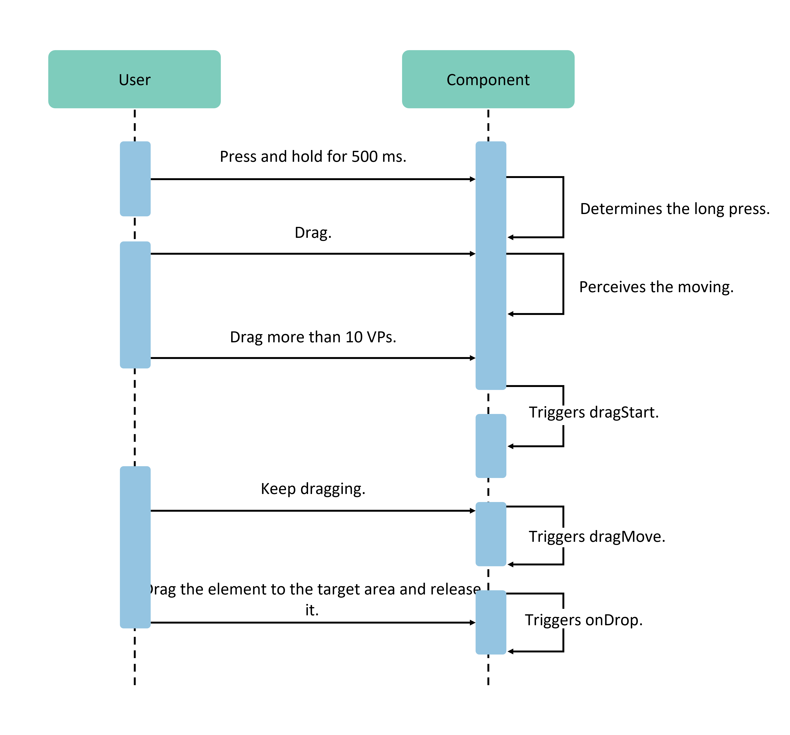

# Drag Events

Drag events provide a mechanism for transferring data through mouse or touch gestures, where data is dragged from one component location and dropped into another to trigger a response. In this process, the drag source provides the data, while the drop target is responsible for receiving and processing it. This operation enables users to conveniently move, copy, or delete specified content.

## Basic Concepts

- **Drag Operation**: A long press and slide on a drag-responsive component triggers the drag behavior. The drag operation ends when the user releases their finger or mouse.
- **Drag Background (Backplate)**: The visual representation of the data being dragged. Developers can configure it via the `onDragStart` [function](../../../API_Reference/source_en/arkui-cj/cj-universal-event-drag.md#func-ondragstartdrageventstring------unit) or [`DragItemInfo`](../../../API_Reference/source_en/arkui-cj/cj-universal-event-drag.md#struct-dragiteminfo), or customize it using the [`dragPreview`](../../../API_Reference/source_en/arkui-cj/cj-universal-attribute-dragcontrol.md#func-dragpreviewdragiteminfo) universal attribute.
- **Drag Content**: The data being dragged, encapsulated using the UDMF Unified API `UnifiedData` to ensure consistency and security.
- **Drag Source**: The component that triggers the drag operation and provides the data, typically featuring drag-responsive properties.
- **Drop Target**: The component capable of receiving and processing the dragged data, executing corresponding operations based on the dropped data.
- **Drag Point**: The contact position of the mouse or finger on the screen, used to determine whether it enters the component's bounds. The criterion is whether the contact point lies within the component's area.

## Drag Process

The drag process includes gesture-based and mouse-based drag workflows, helping developers understand the timing of callback event triggers.

### Gesture-Based Drag Process

For scenarios where a long press triggers dragging, ArkUI verifies whether the current component supports drag functionality before initiating the drag. For components that are draggable by default (Search, TextInput, TextArea, RichEditor, Text, Image, Hyperlink), the [`draggable`](../../../API_Reference/source_en/arkui-cj/cj-universal-attribute-dragcontrol.md#func-draggablebool) attribute must be set to `true` (if the system enables hierarchical parameters, `draggable` defaults to `true`). For other components, an `onDragStart` callback must also be configured. Once these conditions are met, a long press of 500ms or more triggers the drag operation. At 800ms, the system initiates the floating animation for the preview image. If combined with the Menu feature and controlled via `isShow`, it is advisable to avoid displaying the menu after 800ms of user interaction, as this may lead to unintended behavior.

Gesture-based drag (finger/stylus) triggering process:

### Mouse-Based Drag Process

Mouse drag operations follow a "drag-and-go" model. When the left mouse button is pressed and moved over a draggable component by more than 1vp, the drag functionality is triggered.

Currently, both intra-application and cross-application drag operations are supported. To help developers better perceive drag states and adjust the system's default drag behavior, ArkUI provides multiple callback events, as detailed below:

| **Callback Event** | **Description** |
| :---------------- | :------------------------ |
| [`onDragStart`](../../../API_Reference/source_en/arkui-cj/cj-universal-event-drag.md#func-ondragstartdrageventstring------unit) | Triggered when the drag source initiates the drag action.  This callback allows developers to perceive the start of the drag behavior. They can set the data to be transferred during dragging and customize the backplate image in the `onDragStart` method. It is recommended to use `pixelmap` for the backplate image to avoid the additional performance overhead of `customBuilder`. |
| [`onDragEnter`](../../../API_Reference/source_en/arkui-cj/cj-universal-event-drag.md#func-ondragenterdrageventstring---unit) | Triggered when the drag point enters the bounds of a component that listens for the [`onDrop`](../../../API_Reference/source_en/arkui-cj/cj-universal-event-drag.md#func-ondropdrageventstring---unit) event. |
| [`onDragMove`](../../../API_Reference/source_en/arkui-cj/cj-universal-event-drag.md#func-ondragmovedrageventstring---unit) | Triggered when the drag point moves within the bounds of a component that listens for the [`onDragMove`](../../../API_Reference/source_en/arkui-cj/cj-universal-event-drag.md#func-ondragmovedrageventstring---unit) event.  During this process, the [`DragEvent`](../../../API_Reference/source_en/arkui-cj/cj-universal-event-drag.md#class-dragevent) `setResult` method can be called to influence the system's visual behavior in certain scenarios:  1. Set `DragResult.DROP_ENABLED`.  2. Set `DragResult.DROP_DISABLED`. |
| [`onDragLeave`](../../../API_Reference/source_en/arkui-cj/cj-universal-event-drag.md#func-ondragleavedrageventstring---unit) | Triggered when the drag point exits the bounds of a component that listens for the `onDrop` event.  The system does not trigger `onDragLeave` in two cases:  1. Moving from a parent component to a child component.  2. Overlapping layouts between the target and current components. |
| [`onDrop`](../../../API_Reference/source_en/arkui-cj/cj-universal-event-drag.md#func-ondropdrageventstring---unit) | Triggered when the user releases the drag operation within the component bounds. Developers must use the `DragEvent` `setResult` method in this callback to set the drag result. Otherwise, the drag source component's `onDragEnd` method will only retrieve the default result, `DragResult.DRAG_FAILED`.  This callback is key for developers to intervene in the system's default drop behavior. The system prioritizes the developer-defined `onDrop` callback. By calling `setResult` in `onDrop`, developers can instruct the system on how to handle the dragged data:  1. Set `DragResult.DRAG_SUCCESSFUL`: Data is fully handled by the developer, and the system does not process it.  2. Set `DragResult.DRAG_FAILED`: The system stops processing the data.  3. Set `DragResult.DRAG_CANCELED`: The system also does not process the data.  4. Setting `DragResult.DROP_ENABLED` or `DragResult.DROP_DISABLED` is ignored and treated as `DragResult.DRAG_FAILED`. |
| [`onDragEnd`](../../../API_Reference/source_en/arkui-cj/cj-universal-event-drag.md#func-ondragenddrageventstring---unit) | Triggered when the user releases the drag, ending the drag activity. The drag source component fires this event. |
| [`onPreDrag`](../../../API_Reference/source_en/arkui-cj/cj-universal-event-drag.md#func-onpredragpredragstatus---unit) | Triggered by the component bound to this event at different stages of the drag process.  Developers can use this method to prepare data based on the [`PreDragStatus`](../../../API_Reference/source_en/arkui-cj/cj-universal-event-drag.md#enum-predragstatus) enumeration before dragging begins:  1. `ACTION_DETECTING_STATUS`: Drag gesture initiation phase. Triggered at 50ms press.  2. `READY_TO_TRIGGER_DRAG_ACTION`: Drag preparation complete, ready to initiate. Triggered at 500ms press.  3. `PREVIEW_LIFT_STARTED`: Drag floating animation initiation phase. Triggered at 800ms press.  4. `PREVIEW_LIFT_FINISHED`: Drag floating animation completion phase. Triggered when the animation fully ends.  5. `PREVIEW_LANDING_STARTED`: Drag landing animation initiation phase. Triggered when the landing animation starts.  6. `PREVIEW_LANDING_FINISHED`: Drag landing animation completion phase. Triggered when the animation fully ends.  7. `ACTION_CANCELED_BEFORE_DRAG`: Drag floating/landing animation interruption. Triggered when the finger is lifted after `READY_TO_TRIGGER_DRAG_ACTION` but before reaching the animation phase. |

The `get` methods supported by [`DragEvent`](../../../API_Reference/source_en/arkui-cj/cj-universal-event-drag.md#class-dragevent) can retrieve detailed information about the drag behavior. The table below shows which `get` methods return valid data in the corresponding drag callbacks.

| Callback Event | onDragStart | onDragEnter | onDragMove | onDragLeave | onDrop | onDragEnd |
| :- | :- | :- | :- | :- | :- | :- |
| getResult       |—|—|—|—|—| Supported |
| getPreviewRect  |—|—|—|—| Supported |—|
| getVelocity/X/Y |—| Supported | Supported | Supported | Supported |—|
| getWindowX/Y    | Supported | Supported | Supported | Supported | Supported |—|
| getDisplayX/Y   | Supported | Supported | Supported | Supported | Supported |—|

The `set` methods supported by [`DragEvent`](../../../API_Reference/source_en/arkui-cj/cj-universal-event-drag.md#class-dragevent) allow developers to pass information to the system, which may affect UI or data handling. The table below indicates in which callback phases these `set` methods are accepted and processed by the system.

| Callback Event | onDragStart | onDragEnter | onDragMove | onDragLeave | onDrop |
| :- | :- | :- | :- | :- | :- |
| useCustomDropAnimation |—|—|—|—| Supported |
| setResult              | Supported (can set `failed` or `cancel` to prevent drag initiation) | Supported (not passed as final result to `onDragEnd`) | Supported (not passed as final result to `onDragEnd`) | Supported (not passed as final result to `onDragEnd`) | Supported (passed as final result to `onDragEnd`) |

## Drag Backplate Image

The backplate image displayed during drag movement is not the component itself but represents the data being dragged. Developers can set it to any displayable image. Specifically:
- The `customBuilder` or `pixelmap` returned in the `onDragStart` callback can configure the backplate image during drag movement.
- The floating image defaults to a screenshot of the component itself.
- The `customBuilder` or `pixelmap` set in the `dragPreview` attribute can configure the backplate image for both floating and drag processes.
- If no backplate image is configured, the system automatically uses a screenshot of the component as the backplate image for both floating and dragging.

The drag backplate image currently supports transparency, rounded corners, shadows, and blur effects. For details, refer to [Drag Control](../../../API_Reference/source_en/arkui-cj/cj-universal-attribute-dragcontrol.md).

**Constraints:**

- For container components, if internal content extends beyond the container bounds via `position`, `offset`, etc., the system screenshot cannot capture out-of-bounds content. In such cases, if floating (i.e., the drag backplate must include out-of-bounds content), consider expanding the container bounds or using custom implementations.
- Whether using a custom `builder` or the system's default screenshot method, screenshots currently cannot apply graphical transformations like [`scale`](../../../API_Reference/source_en/arkui-cj/cj-universal-attribute-transform.md#func-scalefloat32-float32-float32-length-length) or [`rotate`](../../../API_Reference/source_en/arkui-cj/cj-universal-attribute-transform.md#func-rotatefloat32-float32-float32-float64-length-length).