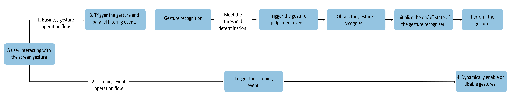

# Gesture Interception

Gesture interception is primarily used to ensure gestures are executed as needed, effectively resolving gesture conflicts. Typical application scenarios include: nested scrolling, optimizing interaction experience by filtering component response ranges to gestures. Gesture interception is mainly implemented through [Gesture Trigger Control](#gesture-trigger-control) and [Gesture Response Control](#gesture-response-control).

## Gesture Trigger Control

Gesture trigger control refers to the scenario where, after the system determines that the threshold conditions are met, the application can independently decide whether to intercept the gesture, causing the gesture operation to fail.

Gesture trigger control involves the following interfaces.

|**Interface**|**Description**|
|:---|:---|
| [onGestureJudgeBegin](../../../API_Reference/source_en/arkui-cj/cj-universal-gesture-judge.md#func-ongesturejudgebegingestureinfo-basegestureevent---gesturejudgeresult) | Used for gesture interception, it is a universal event. In scenarios where gestures meet the system trigger threshold, it calls back to the application to determine whether to intercept the gesture. |

## Gesture Response Control

Gesture response control refers to the situation where a gesture has been successfully recognized, but developers can still control whether the gesture callback can respond by calling API interfaces.

**Figure 1** Gesture Response Control Flowchart

The prerequisite for gesture response control is successful gesture recognition; if the gesture is not successful, no gesture callback response will be generated.

1. **Business Gesture Workflow**: Refers to the actual business gestures that trigger UI changes, such as PanGesture for page scrolling, TapGesture for triggering clicks, etc.

2. **Monitoring Gesture Workflow**: Refers to dynamically controlling the start and stop of gesture recognizers based on contextual business state changes during the monitoring gesture operation, such as whether a component has reached the edge during nested scrolling. This monitoring event can be implemented using a PanGesture with Parallel Gesture Binding or by using Touch events.

3. **Setting Parallel Gestures**: This step is not mandatory. A typical scenario is setting parallel scrolling gestures between outer and inner components in nested scrolling.

4. **Dynamically Enabling/Disabling Gestures**: Refers to controlling whether gestures respond to user callbacks through the setEnable method of the gesture recognizer.

Gesture response control involves the following interfaces.

|**Interface**|**Description**|
|:---|:---|
| [parallelGesture](../../../API_Reference/source_en/arkui-cj/cj-universal-gesture-bind.md#func-parallelgesturegesturetype-gesturemask) | Allows developers to define gestures that run in parallel with higher-priority gestures. |