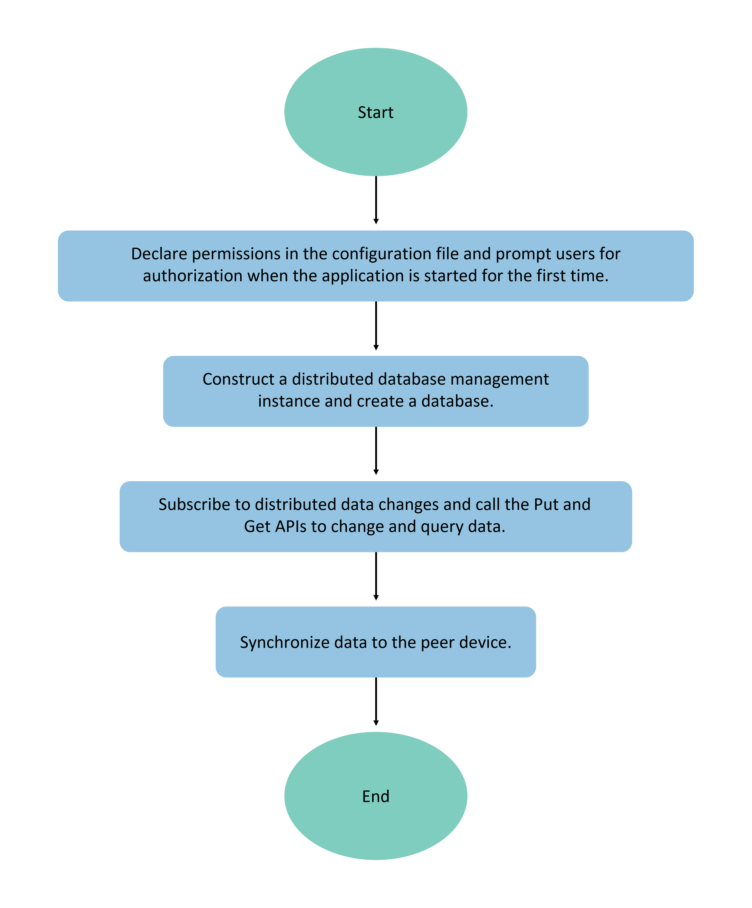

# Implementing Data Persistence with Relational Databases

## Scenario Description

Relational databases, based on the SQLite component, are suitable for scenarios involving complex relational data storage. Examples include student information in a class (containing names, student IDs, subject scores, etc.) or employee information in a company (including names, employee IDs, positions, etc.). When data exhibits strong interrelationships and higher complexity than key-value data, relational databases should be used for persistent storage.

For large-scale data queries that may cause prolonged response times or application unresponsiveness, the following recommendations apply:

- Limit single queries to no more than 5,000 records.
- Keep SQL statement concatenation as concise as possible.
- Implement reasonable batch querying.

## Basic Concepts

- **Predicate:** A term in databases representing properties, characteristics of data entities, or relationships between them, primarily used to define database operation conditions.
- **Result Set:** The collection of results returned from user queries, enabling data access. Result sets provide flexible data access methods for easier retrieval of desired information.

## Operational Mechanism

Relational databases offer universal operation interfaces to applications, with SQLite serving as the underlying persistent storage engine. They support all SQLite database features, including but not limited to transactions, indexes, views, triggers, foreign keys, parameterized queries, and prepared SQL statements.

**Figure 1** Relational Database Operational Mechanism



## Constraints and Limitations

- The system defaults to WAL (Write Ahead Log) mode for logging and FULL mode for disk persistence.
- The database maintains 4 read connections and 1 write connection. Threads can perform read operations when acquiring an idle read connection. If no read connections are available but a write connection is idle, the write connection will be used for reading.
- To ensure data accuracy, only one write operation is supported at any given time.
- When an application is uninstalled, all related database files and temporary files on the device are automatically removed.
- Supported basic data types on the Cangjie side: Int64, Float64, String, binary data, Bool.
- To ensure successful data insertion and retrieval, it is recommended that single records do not exceed 2MB. Larger records may insert successfully but fail to read.

## API Description

The following are key APIs for relational database persistence. For more APIs and usage details, refer to [Relational Database](../../../API_Reference/source_en/apis/ArkData/cj-apis-relational_store.md).

| API Name | Description |
| -------- | -------- |
| getRdbStore(context: StageContext, config: StoreConfig): RdbStore | Obtains an RdbStore instance for relational database operations. Developers can configure RdbStore parameters as needed and perform data operations through its methods. |
| executeSql(sql: String, bindArgs: Array\<RelationalStoreValueType>): Unit | Executes an SQL statement with specified parameters that does not return values. |
| insert(table: String, values: Map\<String, RelationalStoreValueType>): Int64 | Inserts a row of data into the target table. |
| update(values: Map\<String, RelationalStoreValueType>, predicates: RdbPredicates): Int64 | Updates database data based on specified predicate conditions. |
| delete(predicates: RdbPredicates): Int64 | Deletes data from the database based on specified predicate conditions. |
| query(predicates: RdbPredicates, columns: Array\<String>): ResultSet| Queries database data based on specified conditions. |
| deleteRdbStore(context: StageContext, name: String): Unit | Deletes a database. |

## Development Procedure

During relational database operations or storage, unexpected exceptions (error code 14800011) may occur. In such cases, the database should be rebuilt and data restored to ensure normal application development.

1. To implement data persistence with relational databases, obtain an RdbStore instance, which handles database creation, table creation, upgrades/downgrades, etc. Example code:

    <!-- compile -->

    ```cangjie
    import ohos.business_exception.BusinessException
    import kit.ArkData.*
    import kit.AbilityKit.getStageContext
    import std.collection.HashMap
    import kit.AbilityKit.{UIAbility, AbilityStage, Want, LaunchParam, LaunchReason, UIAbilityContext}
    import ohos.data.relational_store.RdbStore
    import kit.ArkData.{StoreConfig, getRdbStore, RdbPredicates, deleteRdbStore}
    import ohos.data.relational_store.SecurityLevel as RelationalStoreSecurityLevel
    import kit.ArkUI.{WindowStage}

    let storeConfig_ = StoreConfig(
    RelationalStoreSecurityLevel.S3,// Database security level
    name: "RdbTest.db", // Database filename
    encrypt: false, // Optional parameter, specifies whether to encrypt the database (default: false)
    customDir: "customDir/subCustomDir", // Optional parameter, custom database path. The database will be created in: context.databaseDir + '/rdb/' + customDir, where context.databaseDir is the application sandbox path, '/rdb/' indicates a relational database, and customDir is the custom path. If omitted, creates RdbStore in the default sandbox directory.
    )

    let storeConfig = StoreConfig(
        "RdbTest.db", // Database filename
        RelationalStoreSecurityLevel.S3, // Database security level
        encrypt: false, // Optional parameter
        customDir: "customDir/subCustomDir", // Optional parameter
    )

    // Check database version; perform upgrade/downgrade if mismatched
    // Assuming current database version is 3 with table structure: EMPLOYEE (ID, NAME, AGE, SALARY, CODES)
    const SQL_CREATE_TABLE = "CREATE TABLE EMPLOYEE(ID int NOT NULL, NAME varchar(255) NOT NULL, AGE int, SALARY float NOT NULL, CODES Bit NOT NULL, PRIMARY KEY (Id))"
    var rdbStore: Option<RdbStore> = Option<RdbStore>.None

    // This example implements in Ability; can be used in other appropriate scenarios
    class MainAbility <: UIAbility {
        public init() {
            super()
            registerSelf()
        }

        public override func onCreate(want: Want, launchParam: LaunchParam): Unit {
            match (launchParam.launchReason) {
                case LaunchReason.StartAbility => Hilog.info(0, "cangjie", "START_ABILITY")
                case _ => ()
            }
        }

        public override func onWindowStageCreate(windowStage: WindowStage): Unit {
            Hilog.info(0, "cangjie", "MainAbility onWindowStageCreate.")
            windowStage.loadContent("EntryView")
            let store = getRdbStore(this.context, storeConfig)
            store.executeSql(SQL_CREATE_TABLE) // Create table
            store.executeSql('ALTER TABLE EMPLOYEE ADD COLUMN AGE INTEGER')
            store.executeSql('ALTER TABLE EMPLOYEE DROP COLUMN ADDRESS TEXT')
            rdbStore = store
            // Perform CRUD operations
            // ...
        }
        // ...
    }
    ```

    > **Note:**
    >
    > - Databases created by applications are context-dependent. Even with identical names, different application contexts will create separate databases (e.g., each Ability has its own context).
    > - When an application first accesses a database (via getRdbStore), corresponding database files are created in the application sandbox. Temporary files with -wal and -shm extensions may appear in the same directory during use. To move database files elsewhere, these temporary files must also be moved. Uninstalling the application removes all associated database and temporary files.
    > - For detailed error codes, see [Universal Error Codes](../../../API_Reference/source_en/errorcodes/cj-errorcode-universal.md) and [Relational Database Error Codes](../../../API_Reference/source_en/errorcodes/cj-errorcode-data-rdb.md).

2. After obtaining RdbStore, use insert() to add data. Example:

    <!-- compile -->

    ```cangjie
    import ohos.data.relational_store.ValueType as RelationalStoreValueType 

    var values = HashMap<String, RelationalStoreValueType>()
    values.add("ID", RelationalStoreValueType.Integer(1))
    values.add("NAME", RelationalStoreValueType.StringValue("Lisa"))
    values.add("AGE", RelationalStoreValueType.Integer(18))
    values.add("SALARY", RelationalStoreValueType.Double(100.5))
    values.add("CODES", RelationalStoreValueType.Boolean(true))
    rdbStore.getOrThrow().insert("EMPLOYEE", values)
    ```

    > **Note:**
    >
    > Relational databases don't require explicit flush operations for persistence—data is saved to persistent storage upon insertion.

3. Modify or delete data using predicate conditions.

    Use update() to modify data and delete() to remove data. Example:

    <!-- compile -->

    ```cangjie
    // Update data
    try {
        let predicates1 = RdbPredicates('EMPLOYEE')  // Create predicates for 'EMPLOYEE' table
        predicates1.equalTo("NAME", RelationalStoreValueType.StringValue("Lisa")) // Match records where "NAME" equals "Lisa"

        var values = HashMap<String, RelationalStoreValueType>()
        values.add("NAME", RelationalStoreValueType.StringValue("TOM"))
        values.add("AGE", RelationalStoreValueType.Integer(88))
        values.add("SALARY", RelationalStoreValueType.Double(9999.513))
        let rowsCnt = rdbStore.getOrThrow().update(values, predicates1)
    } catch (e: BusinessException) {
        Hilog.error(0, "ErrorCode: ${e.code}", e.message)
    }

    // Delete data
    try {
        let predicates1 = RdbPredicates('EMPLOYEE')  // Create predicates for 'EMPLOYEE' table
        predicates1.equalTo("NAME", RelationalStoreValueType.StringValue("Lisa")) // Match records where "NAME" equals "Lisa"

        let rowsCnt = rdbStore.getOrThrow().delete(predicates1)
    } catch (e: BusinessException) {
        Hilog.error(0, "ErrorCode: ${e.code}", e.message)
    }
    ```

4. Query data using predicate conditions.

    Use query() to retrieve data, returning a ResultSet. Example:

    <!-- compile -->

    ```cangjie
    try {
        let predicates2 = RdbPredicates('EMPLOYEE')  // Create predicates for 'EMPLOYEE' table
        predicates2.equalTo("NAME", RelationalStoreValueType.StringValue("Rose")) // Match records where "NAME" equals "Rose"

        let columns = ["ID", "NAME", "AGE", "SALARY", "CODES"]
        let resultSet = rdbStore.getOrThrow().query(predicates2, columns:columns)
        // ResultSet is a cursor starting at position -1; valid data begins at 0.

        while (resultSet.goToNextRow()) {
            let id = resultSet.getLong(resultSet.getColumnIndex('ID'))
            let name = resultSet.getString(resultSet.getColumnIndex('NAME'))
            let age = resultSet.getLong(resultSet.getColumnIndex('AGE'))
            let salary = resultSet.getDouble(resultSet.getColumnIndex('SALARY'))
        }
        // Release ResultSet memory
        resultSet.close()
    } catch (e: BusinessException) {
        Hilog.error(0, "ErrorCode: ${e.code}", e.message)
    }
    ```

    > **Note:**
    >
    > Always call close() on ResultSet after use to release allocated memory.

5. Back up the database in the same path. Relational databases support both manual and automatic backup (system apps only). See [Relational Database Backup](cj-data-backup-and-restore.md#关系型数据库备份).

    Manual backup example:

    <!-- compile -->

    ```cangjie
    try {
        // "Backup.db" is the backup filename, created in the same path as RdbStore by default. Custom paths: customDir + "backup.db"
        rdbStore.getOrThrow().backup("Backup.db")
        Hilog.info(0, "cangjie", "Succeeded in backup data.")
    } catch (e: BusinessException) {
        Hilog.error(0, "ErrorCode: ${e.code}", e.message)
    }
    ```

6. Restore data from backup. Two methods are supported: restoring manual backups and restoring automatic backups (system apps only). See [Relational Database Restoration](cj-data-backup-and-restore.md#关系型数据库数据恢复).

    Example using [restore](../../../API_Reference/source_en/apis/ArkData/cj-apis-relational_store.md#func-restorestring) for manual backups:

    <!-- compile -->

    ```cangjie
    try {
        rdbStore.getOrThrow().restore("Backup.db")
        Hilog.info(0, "cangjie", "Succeeded in backup data.")
    } catch (e: BusinessException) {
        Hilog.error(0, "ErrorCode: ${e.code}", e.message)
    }
    ```

7. Delete the database.

    Use deleteRdbStore() to remove the database and related files. Example:

    <!-- compile -->

    ```cangjie
    try {
        deleteRdbStore(this.context, StoreConfig(RelationalStoreSecurityLevel.S3, name: "RdbTest.db", ))
        Hilog.info(0, "cangjie", "Succeeded in delete RdbStore.")
    } catch (e: BusinessException) {
        Hilog.error(0, "ErrorCode: ${e.code}", e.message)
    }
    ```