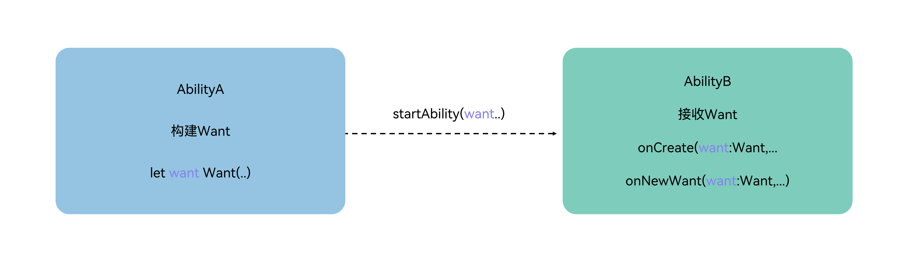

# Want概述

## Want的定义与用途

[Want](../../../API_Reference/source_zh_cn/apis/AbilityKit/cj-apis-ability.md#class-want)是一种对象，用于在应用组件之间传递信息。

其中，一种常见的使用场景是作为[startAbility()](../../../API_Reference/source_zh_cn/apis/AbilityKit/cj-apis-ability.md#func-startabilitywant)方法的参数。例如，当UIAbilityA需要启动UIAbilityB并向UIAbilityB传递一些数据时，可以使用Want作为一个载体，将数据传递给UIAbilityB。

**图1** Want用法示意

<!-- ToBeReviewd -->

## Want的类型

- **显式Want**：在启动目标应用组件时，调用方传入的[Want](../../../API_Reference/source_zh_cn/apis/AbilityKit/cj-apis-ability.md#class-want)参数中指定了abilityName和bundleName，称为显式Want。

    显式Want通常用于应用内组件启动，通过在Want对象内指定本应用Bundle名称信息（bundleName）和abilityName来启动应用内目标组件。当有明确处理请求的对象时，显式Want是一种简单有效的启动目标应用组件的方式。

  <!-- compile -->

  ```cangjie
  import kit.AbilityKit.Want

  let wantInfo = Want(deviceId: "", bundleName: "com.example.myapplication", abilityName: "FuncAbility")
  ```

- **隐式Want**：在启动目标应用组件时，调用方传入的[Want](../../../API_Reference/source_zh_cn/apis/AbilityKit/cj-apis-ability.md#class-want)参数中未指定abilityName，称为隐式Want。

  当需要处理的对象不明确时，可以使用隐式Want，在当前应用中使用其他应用提供的某个能力，而不关心提供该能力的具体应用。隐式Want使用[skills标签](../cj-start/basic-knowledge/module-configuration-file.md#skills标签)来定义需要使用的能力，并由系统匹配声明支持该请求的所有应用来处理请求。例如，需要打开一个链接的请求，系统将匹配所有声明支持该请求的应用，然后让用户选择使用哪个应用打开链接。
  
  <!-- compile -->

  ```cangjie
  import kit.AbilityKit.Want
  
  // uncomment line below if wish to implicitly query only in the specific bundle.
  // bundleName: 'com.example.myapplication'
  let wantInfo = Want(action: "ohos.want.action.search",
      // entities can be omitted
      entities: ["entity.system.browsable"],
      uri: "https://www.test.com:8080/query/student",
      wantType: "text/plain")
  ```

    > **说明：**
    >
    > 根据系统中待匹配应用组件的匹配情况不同，使用隐式Want启动应用组件时会出现以下三种情况。
    >
    > - 未匹配到满足条件的应用组件：启动失败。
    > - 匹配到一个满足条件的应用组件：直接启动该应用组件。
    > - 匹配到多个满足条件的应用组件（[UIAbility](../../../API_Reference/source_zh_cn/apis/AbilityKit/cj-apis-ability.md#class-uiability)）：弹出选择框让用户选择。
