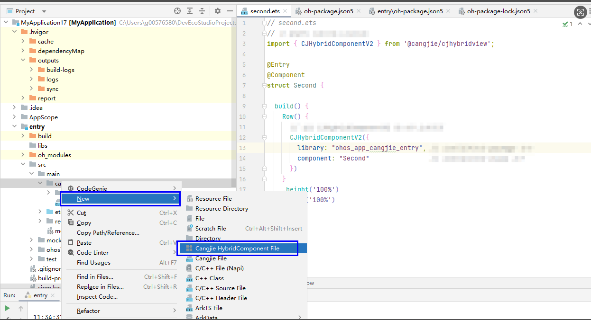

# Adding a Cangjie Page

In ArkTS using Cangjie, adding a Cangjie Page (Page) is supported. In OpenHarmony, a page is part of the application interface responsible for displaying user interface elements such as text, buttons, images, etc., as well as handling user interactions.

> **Note:**
>
> In hybrid development scenarios involving Cangjie and ArkTS, a Cangjie page is not a full-fledged page with a complete lifecycle in the true sense. It can only be embedded into an ArkTS page as a component. Therefore, an @Entry page must be provided on the ArkTS side as a container to load the Cangjie page. Hereafter, such Cangjie pages will be referred to as Cangjie page components.

The steps to add a Cangjie page in DevEco Studio are as follows:

1. In the **Project** window, navigate to **entry > src > main**, right-click the **cangjie** folder, and select **New > Cangjie HybridComponent File**. Name it **Second**, as shown below:

   

2. The Cangjie page component files will be generated under the Cangjie directory:

   

   The content of the generated second.cj file is as follows:

   ```cangjie
   package ohos_app_cangjie_entry   // Package name

   import ohos.component.*
   import ohos.state_manage.*
   import ohos.state_macro_manage.*
   import ohos.hybrid_base.*

   // This page component must be decorated with HybridComponentEntry
   @HybridComponentEntry
   @Component
   class Second {
       @State
       var msg: String = "Hello"
       // Cangjie component build
       public func build() {
           Column {
               Text(msg)
               Button("click to change Text").onClick {
                   => msg = "world"
               }
           }
       }
   }
   ```

   The relevant dependencies for the page component will be generated in **entry->oh-package.json5**:

   

3. Create an ArkTS file in **entry->src->main->ets->pages** to serve as the container for loading the Cangjie page component (as explained at the beginning of this section). Name it second.ets, with the following content:

   ```ts
   // Embedding a Cangjie page component in an ArkTS page
   // Import interface functions
   import { CJHybridComponentV2 } from '@cangjie/cjhybridview';

   @Entry
   @Component
   struct Second {
     build() {
       Row() {
         // Embed the Cangjie page via the CJHybridComponentV2 interface
         CJHybridComponentV2({
           library: "ohos_app_cangjie_entry", // The package name where the Cangjie page resides
           component: "Second"                // The class name corresponding to the Cangjie page
         })
       }
       .height('100%')
       .width('100%')
     }
   }
   ```