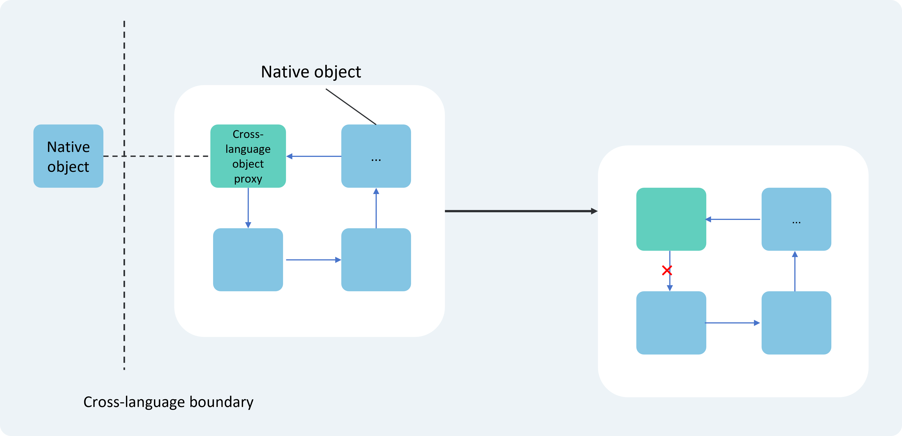

# Cangjie-ArkTS Interoperability Development Specifications

## Multi-Engine Instance Context Sensitivity

**[Rule]** Cross-engine instance access to JS objects is prohibited.

In multi-engine instance scenarios, each JS object (such as instances of JSValue and its subclasses) is bound to the engine instance (JSContext) that created it. Different engine instances operate independently and cannot share JS objects. Accessing JS objects from non-owning engine instances may cause program crashes.

In the Cangjie-ArkTS interoperability library, early interfaces for accessing JS objects required developers to manually pass JSContext parameters. When calling these interfaces, developers must ensure the correct instance is passed. Such interfaces have been marked as "deprecated" and it is recommended to use new interfaces without JSContext parameters instead, which automatically select the correct engine instance.

**Incorrect Example:**

Cangjie code:

```cangjie
// Import interoperability library
import ohos.ark_interop.*

func doSth(context: JSContext, callInfo: JSCallInfo): JSValue {
    // Create new runtime instance
    let newRuntime = JSRuntime()
    let newContext = newRuntime.mainContext

    // Create new object on new runtime
    let newObjValue = newContext.object().toJSValue()

    // Error: Converting new object's JSValue using old runtime instance
    let newObj = newObjValue.asObject(context)

    // Error: Using old runtime as parameter when setting property on new object
    newObjValue.setProperty(context, newContext.string("a"), newContext.boolean(false).toJSValue())

    // Error: Using string key created by old runtime when getting object property
    newObjValue.getProperty(newContext, context.string("a"))

    return newObjValue
}

let EXPORT_MODULE = JSModule.registerModule {
    runtime, exports => exports["doSth"] = runtime.function(doSth).toJSValue()
}
```

**Correct Example:**

Cangjie code:

```cangjie
// Import interoperability library
import ohos.ark_interop.*

func doSth(context: JSContext, callInfo: JSCallInfo): JSValue {
    // Create new runtime instance
    let newRuntime = JSRuntime()
    let newContext = newRuntime.mainContext

    // Create new object on new runtime
    let newObjValue = newContext.object().toJSValue()

    // Correct: Converting new object's JSValue using new runtime instance
    let newObj = newObjValue.asObject()

    // Correct: Using non-deprecated interface when setting property (without explicit context passing)
    newObjValue.setProperty(newContext.string("a"), newContext.boolean(false).toJSValue())

    // Correct: Using string key created by new runtime when getting object property
    newObjValue.getProperty(newContext.string("a"))

    return newObjValue
}

let EXPORT_MODULE = JSModule.registerModule {
    runtime, exports => exports["doSth"] = runtime.function(doSth).toJSValue()
}
```

## Exception Handling

**[Rule]** Use try statements to catch and handle cross-language call exceptions.

In cross-language function calls, exceptions thrown by the callee are automatically converted by the interoperability library into exceptions that can be caught by the caller. The caller should use try statements to catch and handle these exceptions to prevent program errors or crashes.

**Correct Example (Catching Cangjie exceptions on ArkTS side):**

Cangjie side code:

```cangjie
// Import interoperability library
import ohos.ark_interop.*

func doSthWithException(context: JSContext, callInfo: JSCallInfo): JSValue {
    if (callInfo.count > 0) {
        throw Exception("should not pass any argument")
    }
    context.undefined().toJSValue()
}

let EXPORT_MODULE = JSModule.registerModule {
    runtime, exports => exports["doSthWithException"] = runtime.function(doSthWithException).toJSValue()
}
```

ArkTS side code:

```javascript
interface CJLib {
    doSthWithException(src?: string): void
}

function doSth(lib: CJLib): void {
    // Use try...catch to catch cross-language exceptions when calling cross-language interfaces
    try {
        lib.doSthWithException("xxx")
    } catch (err) {
        // ...
    }
}
```

**Correct Example (Catching ArkTS exceptions on Cangjie side):**

Cangjie side code:

```cangjie
// Import interoperability library
import ohos.ark_interop.*

func callArktsWithExp(context: JSContext, callInfo: JSCallInfo): JSValue {
    // Use try...catch to catch cross-language exceptions when calling cross-language interfaces
    try {
        callInfo[0].asFunction().call()
    } catch (err: JSCodeError) {
        // ...
    }
    context.undefined().toJSValue()
}

let EXPORT_MODULE = JSModule.registerModule {
    runtime, exports => exports["callArktsWithExp"] = runtime.function(callArktsWithExp).toJSValue()
}
```

ArkTS side code:

```javascript
interface CJLib {
    callArkTSWithExp(callback: () => void): void
}

function doSth(lib: CJLib): void {
    lib.callArkTSWithExp(() => {
        throw new Error("this is an error")
    })
}
```

## Proper Usage of JS Objects Created via JSContext.external Interface

**[Rule]** Properly use JS Objects created via JSContext.external interface.

JSExternal objects created through JSContext.external appear as undefined type on the ArkTS side and should not be directly used as interface parameters. It is recommended to bind JSExternal objects to a JSObject, encapsulating internal data within the object to enhance interface security and maintainability.

**Incorrect Example:**

Cangjie side code:

```cangjie
// Import interoperability library
import ohos.ark_interop.*

// Define shared class, SharedObject is a class from interoperability library
class Data <: SharedObject {
    Data(
        // Define 2 properties
        var id: Int64,
        let name: String
    ) {}

    static init() {
        // Register functions exported to ark
        JSModule.registerFunc("createData", createData)
        JSModule.registerFunc("setDataId", setDataId)
        JSModule.registerFunc("getDataId", getDataId)
    }

    // Create shared object
    static func createData(context: JSContext, _: JSCallInfo): JSValue {
        // Create Cangjie object
        let data = Data(1, "abc")
        // Create JS reference to Cangjie object
        let jsExternal = context.external(data)
        // Return JS reference to Cangjie object
        return jsExternal.toJSValue()
    }

    // Set object's id
    static func setDataId(context: JSContext, callInfo: JSCallInfo): JSValue {
        // Read parameters
        let arg0 = callInfo[0]
        let arg1 = callInfo[1]

        // Convert parameter 0 to JS reference to Cangjie object
        let jsExternal = arg0.asExternal(context)
        // Get Cangjie object
        let data: Data = jsExternal.cast<Data>().getOrThrow()
        // Convert parameter 1 to Float64
        let value = arg1.toNumber()

        // Modify property of Cangjie object
        data.id = Int64(value)

        // Return undefined
        let result = context.undefined().toJSValue()
        return result
    }

    // Get object's id
    static func getDataId(context: JSContext, callInfo: JSCallInfo): JSValue {
        let arg0 = callInfo[0]

        let jsExternal = arg0.asExternal(context)

        let data: Data = jsExternal.cast<Data>().getOrThrow()

        let result = context.number(Float64(data.id)).toJSValue()
        return result
    }
}
```

ArkTS interface declaration corresponding to Cangjie side code:

```javascript
export declare function createData(): undefined;
export declare function setDataId(data: undefined, value: number): void;
export declare function getDataId(data: undefined): number;
```

ArkTS side code:

```javascript
import { createData, setDatId, getDataId } from "libohos_app_cangjie_entry.so";

// Create shared object
let data = createData();
// Manipulate object properties
setDataId(data, 3);
let id = getDataId(data);

console.log("id is " + id);
```

**Correct Example:**

Cangjie side code:

```cangjie
// Import interoperability library
import ohos.ark_interop.*

// Define shared class
class Data <: SharedObject {
    Data(
        // Define 2 properties
        var id: Int64,
        let name: String
    ) {}

    static init() {
        // Register function exported to ark
        JSModule.registerFunc("createData", createData)
    }

    // Create shared object
    static func createData(context: JSContext, _: JSCallInfo): JSValue {
        let data = Data(1, "abc")
        let jsExternal = context.external(data)

        // Create empty JSObject
        let object = context.object()
        // Attach JS reference to Cangjie object as hidden property of JSObject
        object.attachCJObject(jsExternal)

        // Add 2 methods to JS object
        object["setId"] = context.function(setDataId).toJSValue()
        object["getId"] = context.function(getDataId).toJSValue()

        return object.toJSValue()
    }

    // Set object's id
    static func setDataId(context: JSContext, callInfo: JSCallInfo): JSValue {
        // Get this pointer
        let thisArg = callInfo.thisArg
        let arg0 = callInfo[0]

        // Convert this pointer to JSObject
        let thisObject = thisArg.asObject(context)
        // Get hidden property from JSObject
        let jsExternal = thisObject.getAttachInfo().getOrThrow()
        // Get Cangjie object from JS reference
        let data = jsExternal.cast<Data>().getOrThrow()
        // Convert parameter 0 to Float64
        let value = arg0.toNumber()

        // Modify property of Cangjie object
        data.id = Int64(value)

        let result = context.undefined()
        return result.toJSValue()
    }

    // Get object's id
    static func getDataId(context: JSContext, callInfo: JSCallInfo): JSValue {
        let thisArg = callInfo.thisArg
        let thisObject = thisArg.asObject(context)
        let jsExternal = thisObject.getAttachInfo().getOrThrow()
        let data = jsExternal.cast<Data>().getOrThrow()

        let result = context.number(Float64(data.id)).toJSValue()
        return result
    }
}
```

ArkTS interface declaration corresponding to Cangjie side code:

```javascript
export declare interface Data {
    setId(value: number): void;
    getId(): number;
}

export declare function createData(): Data;
```

ArkTS side code:

```javascript
import { createData } from "libohos_app_cangjie_entry.so";

// Create shared object
let data = createData();
// Manipulate object properties
data.setId(3);
let id = data.getId();

console.log("id is " + id);
```

## Cross-Language Object References

**[Rule]** When passing objects across languages, developers should avoid having local proxy objects hold references to native objects, or promptly nullify such references after use to prevent memory leaks.

During cross-language interoperability, circular references between cross-language objects can easily occur, preventing related objects from being released and causing memory leaks. The root cause of circular references lies in the circular dependency formed between proxy objects of cross-language objects (typically parameters or return values of cross-language methods) and native objects. Since their respective garbage collection (GC) mechanisms cannot automatically identify and handle such cross-runtime references, manual management by developers is required.



As shown in the diagram above, to avoid such issues, it is recommended that developers avoid having proxy objects directly reference native objects during design. If business scenarios genuinely require proxy objects to hold references to native objects, developers should promptly release the references to native objects after use.

Circular reference incorrect example:

Cangjie side code:

```cangjie
import ohos.ark_interop.*

class CJData <: SharedObject {
    let name: String
    var callback: ?()->Unit = None
    init(name: String) {
        this.name = name
    }
}

func createCJData(context: JSContext, callInfo: JSCallInfo): JSValue {
    let object = context.object()
    let data = CJData(callInfo[0].toString())
    object.attachCJObject(context.external(data))
    object.defineOwnAccessor("name", getter: { context, callInfo =>
        context.string(data.name).toJSValue()
    })
    object.defineOwnAccessor("callback", setter: {context, callInfo =>
        let callback = callInfo[0].asFunction()
        data.callback = { =>
            callback.call()
        }
        context.undefined().toJSValue()
    })

    object.toJSValue()
}

let EXPORT_MODULE = JSModule.registerModule {
    runtime, exports => exports["createCJData"] = runtime.function(createCJData).toJSValue()
}
```

ArkTS interface declaration corresponding to Cangjie side code:

```javascript
export declare interface CJData {
    name: string;
    callback: () => void;
}

export declare function createCJData(): CJData;
```

ArkTS side code:

```javascript
import { createCJData, CJData } from "libohos_app_cangjie_entry.so"

const data: CJData = createCJData("123")
data.callback = () => {
    console.log(data.name)
}
```

The circular reference in the above example occurs as follows:

1. The CJData object **data** created on the ArkTS side holds the Cangjie object via external
2. The Cangjie object (of type CJData) holds the **callback** variable
3. **callback** captures the callback function from the ArkTS side
4. The callback function on the ArkTS side captures the CJData object **data** created on the ArkTS side

Assuming this scenario is required by business needs, developers should promptly nullify data.callback after its execution to break the circular reference. Example:

```cangjie
// ...
data.callback()
data.callback = () = {}
// ...
```## In ArkTS main thread calls to Cangjie interfaces, blocking waits for spawn(Main) execution results are prohibited

**【Rule】** In ArkTS main thread calls to Cangjie interfaces, blocking waits for spawn(Main) execution results must not occur in the main thread, otherwise it will cause deadlock and trigger App Freeze failures.

When calling Cangjie interfaces from the ArkTS main thread, Cangjie code may use spawn(Main) expressions to dispatch asynchronous tasks to the main thread. This operation is typically used to return Cangjie interface execution results to the ArkTS side. Developers must note that blocking waits for spawn(Main) execution results must not occur in the main thread, otherwise it will cause deadlock and trigger App Freeze failures (APP_INPUT_BLOCK). Common blocking behaviors include but are not limited to:

- Using future.get() to wait for spawn(Main) expression return values;
- Using Mutex's lock() interface to acquire locks that would be released in spawn(Main) tasks.

**Incorrect Example:**

Cangjie-side code:

```cangjie
import ohos.ark_interop.*
import ohos.ark_interop_macro.*
import ohos.base.Main

@Interop[ArkTS]
public func testCJ(): Unit {
    // ...
    let future = spawn(Main) {
        // ...
    }
    future.get() // Error: spawn(Main) creates a Cangjie task for the main thread, while future.get() waits in the main thread, causing deadlock
    // ...
}
```

ArkTS-side code:

```javascript
import { testCJ } from "libohos_app_cangjie_entry.so"

@Entry
@Component
struct Index {
   // ...
   testCJ() // Calling Cangjie interface in ArkTS main thread
   // ...
}
```

## Cangjie-ArkTS interoperation logic must execute on system threads bound to ArkTS runtime

**【Rule】** When Cangjie calls ArkTS, all operations involving ArkTS data access or interface calls must execute on system threads bound to the ArkTS runtime. Otherwise, JSThreadMisMatch exceptions will be triggered.

Cangjie threads are user-mode threads, and the runtime schedules Cangjie threads to execute on system threads, so Cangjie programs are not bound to specific system threads by default. However, Cangjie-ArkTS interoperation logic must execute on system threads bound to the ArkTS runtime. Therefore, developers must pay attention to the thread where interoperation occurs during development. If not on an ArkTS thread, developers need to use interfaces provided by the interoperation library to switch to ArkTS threads for execution. Developers can use the following interfaces to ensure correct execution of interoperation logic:

- Use JSContext.isInBindThread() to determine whether the current thread can execute interoperation interfaces;
- If thread switching is required, use:
    - JSContext.postJSTask { ... } to create tasks executing on ArkTS threads;
    - If ArkTS is deployed on the main thread, developers can use spawn(Main) syntax to schedule interoperation logic threads to execute on the main thread.

**Incorrect Example:**

Cangjie code:

```cangjie
import ohos.ark_interop.*

func addNumberAsync(context: JSContext, callInfo: JSCallInfo): JSValue {
    // Get parameter list from JSCallInfo
    let arg0: JSValue = callInfo[0]
    let arg1: JSValue = callInfo[1]
    let arg2: JSValue = callInfo[2]

    // Convert JSValue to Cangjie types
    let a: Float64 = arg0.toNumber()
    let b: Float64 = arg1.toNumber()
    let callback = arg2.asFunction(context)

    // Create new Cangjie thread
    spawn {
        // Actual Cangjie function behavior
        let value = a + b
        // Create result
        let result = context.number(value).toJSValue() // Error: Not executing on system thread bound to ArkTS runtime
        // Call js callback
        callback.call(result)
    }

    // Return void
    return context.undefined().toJSValue()
}

let EXPORT_MODULE = JSModule.registerModule {
    runtime, exports => exports["addNumberAsync"] = runtime.function(addNumberAsync).toJSValue()
}
```

**Correct Example (isInBindThread & postJSTask usage):**

Cangjie code:

```cangjie
import ohos.ark_interop.*

func addNumberAsync(context: JSContext, callInfo: JSCallInfo): JSValue {
    // Get parameter list from JSCallInfo
    let arg0: JSValue = callInfo[0]
    let arg1: JSValue = callInfo[1]
    let arg2: JSValue = callInfo[2]

    // Convert JSValue to Cangjie types
    let a: Float64 = arg0.toNumber()
    let b: Float64 = arg1.toNumber()
    let callback = arg2.asFunction(context)

    // Create new Cangjie thread
    spawn {
        // Actual Cangjie function behavior
        let value = a + b
        if (context.isInBindThread()) { // Correct: If current thread is system thread bound to ArkTS runtime, synchronous calls can be made directly
            // Create result
            let result = context.number(value).toJSValue()
            // Call js callback
            callback.call(result)
        } else {                        // Correct: Otherwise use postJSTask to asynchronously dispatch callback to ArkTS thread
            context.postJSTask {
                // Create result
                let result = context.number(value).toJSValue()
                // Call js callback
                callback.call(result)
            }
        }
    }

    // Return void
    return context.undefined().toJSValue()
}

let EXPORT_MODULE = JSModule.registerModule {
    runtime, exports => exports["addNumberAsync"] = runtime.function(addNumberAsync).toJSValue()
}
```

**Correct Example (spawn(Main) usage):**

Cangjie code:

```cangjie
import ohos.ark_interop.*
import ohos.base.Main

func addNumberAsync(context: JSContext, callInfo: JSCallInfo): JSValue {
    // Get parameter list from JSCallInfo
    let arg0: JSValue = callInfo[0]
    let arg1: JSValue = callInfo[1]
    let arg2: JSValue = callInfo[2]

    // Convert JSValue to Cangjie types
    let a: Float64 = arg0.toNumber()
    let b: Float64 = arg1.toNumber()
    let callback = arg2.asFunction(context)

    // Create new Cangjie thread
    spawn {
        // Actual Cangjie function behavior
        let value = a + b
        spawn(Main) { // Correct: Schedule to execute on ArkTS main thread
            // Create result
            let result = context.number(value).toJSValue()
            // Call js callback
            callback.call(result)
        }
    }

    // Return void
    return context.undefined().toJSValue()
}

let EXPORT_MODULE = JSModule.registerModule {
    runtime, exports => exports["addNumberAsync"] = runtime.function(addNumberAsync).toJSValue()
}
```

## In Cangjie applications, ArkTS runtime can only be created using JSRuntime() on the main thread

**【Rule】** In Cangjie applications, ArkTS runtime can only be created using JSRuntime() on the main thread.

Thread environment requirements dictate that JSRuntime must bind to a system thread, and all interoperation interfaces can only be called on this system thread; otherwise undefined behavior will occur. However, Cangjie threads and system threads do not have a 1:1 binding relationship, meaning that JSRuntime created in Cangjie threads spawned by spawn will appear as synchronous calls from the Cangjie perspective, while thread switching will occur from the ArkTS perspective, triggering undefined behavior or crashes. Therefore, creation of JSRuntime is restricted to system threads and prohibited in Cangjie threads.

**Incorrect Example:**

Cangjie code:

```cangjie
import ohos.ark_interop.*

func addNumberAsync(context: JSContext, callInfo: JSCallInfo): JSValue {
    // Get parameter list from JSCallInfo
    let arg0: JSValue = callInfo[0]
    let arg1: JSValue = callInfo[1]
    let arg2: JSValue = callInfo[2]

    // Convert JSValue to Cangjie types
    let a: Float64 = arg0.toNumber()
    let b: Float64 = arg1.toNumber()
    let callback = arg2.asFunction(context)

    // Create new Cangjie thread
    spawn {
        let runtime = JSRuntime() // Error: ArkTS runtime can only be created using JSRuntime() on the main thread
        // ...
    }

    // Return void
    return context.undefined().toJSValue()
}

let EXPORT_MODULE = JSModule.registerModule {
    runtime, exports => exports["addNumberAsync"] = runtime.function(addNumberAsync).toJSValue()
}
```