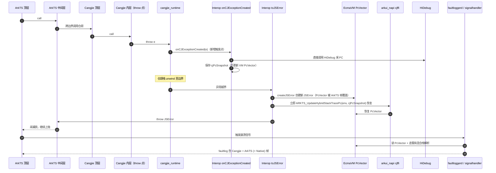
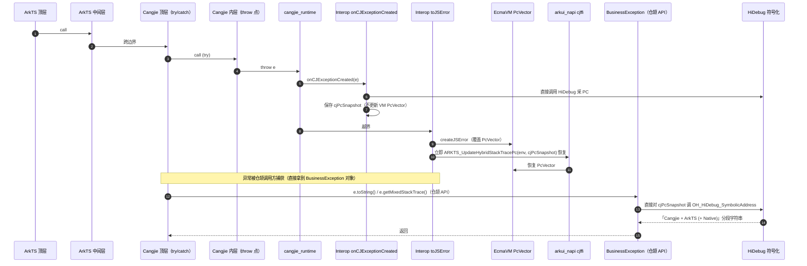

# 混合栈支持仓颉 - 架构设计

> 配套需求文档：[hybridstack_support_cangjie_design.md](./hybridstack_support_cangjie_design.md)
> 适用分支：`feat/hybridstack-redesign`
> 状态：草案 v3（Draft）

## 1. 设计目标对齐

应用形态前提：**ArkTS 为应用入口**，通过互操作调用仓颉模块；仓颉抛出的异常在跨边界时由互操作 `toJSError` 转为 `JSError`，由 ArkTS 侧捕获或继续向上传播。本设计不涉及「纯仓颉应用入口」场景（该场景下未捕获仓颉异常的处理由 ability_runtime 经既有 `CJUncaughtExceptionInfo` 完成，与混合栈无关）。

| 优先级 | 目标 | 验证场景 |
| ------ | ---- | -------- |
| P0 (主要) | faultlog 中能稳定显示仓颉栈帧（异常自仓颉抛出，未被 ArkTS 捕获，最终触发进程崩溃） | ArkTS 入口 → 调用仓颉 → 仓颉 throw → ArkTS 未捕获 → 进程崩溃 → faultlog 含仓颉帧 |
| P1 (次要) | 仓颉侧 `BusinessException.toString()` / `getMixedStackTrace()`（仓颉 API）至少呈现「Cangjie + ArkTS」混合栈 | 仓颉 try/catch 后调用 toString 打印 |
| P2 (可选) | 上述混合栈进一步包含 Native (C/C++) 帧 | 同上 |

## 2. 关键技术约束（决定方案形态的事实）

1. **`EcmaVM::PcVector` 单例语义**：`EcmaVM` 上仅保留最近一次写入的 PC 向量，`createJSError` 会以当前 ArkTS 调用栈覆盖。任何「先把仓颉 PC 写入 PcVector → 再创建 JSError」的顺序都会被覆盖。
2. **仓颉栈帧的有效窗口极短**：`throw e` 触发后，cangjie_runtime 立刻开始 unwind。等到异常跨过互操作边界（`toJSError`）时，仓颉栈已被销毁，从当前 `fp` 调用 `OH_HiDebug_BacktraceFromFp` 已无法采到原 throw 点的帧。**因此 PC 必须在异常构造瞬间采集**。
3. **现有 `CJUncaughtExceptionInfo` 的覆盖面不足**：cangjie_runtime 现有的 `RegisterUncaughtExceptionHandler` 仅在异常未被捕获、进入默认 dispatcher 时触发；触发点已晚于 unwind，无法拿到 throw 点的栈，且本设计场景下所有仓颉异常都会跨边界进入 ArkTS，根本不会走仓颉自己的 dispatcher。
4. **公开 HiDebug 栈回溯 API 可用**：`OH_HiDebug_CreateBacktraceObject` / `OH_HiDebug_BacktraceFromFp` / `OH_HiDebug_SymbolicAddress` 已对外开放，本设计不引入私有依赖。
5. **`BusinessException` 是仓颉 API**：`BusinessException.toString()` / `getMixedStackTrace()` / `getCrossMessage()` 由仓颉代码实现并被仓颉用户代码调用，不是 ArkTS 接口；ArkTS 侧拿到的是 `JSError`，需经互操作再次桥回仓颉对象后才能调用上述方法。
6. **互操作不直连 ets_runtime**：互操作对 ets_runtime 的所有调用统一经 `arkui_napi/interfaces/inner_api/cjffi/ark_interop` 中转。
7. **二进制兼容性**：`BusinessException` 公开 API 与错误码 34300001-34300008 必须保持兼容。

修改建议：调整一下此小节内容，参考方案设计架构图补充一个现有最新master主干实现的架构图，并且指出现有方案效果和设计目标的差距，最后在补充关键技术约束
修改建议：有些约束是用户或者方案审查的时候需要感知到的，有些约束纯粹是写这份文档的时候调整方向过程性的，就像本地修改的多个试验性质的commit再合入代码前应当squash一样，这种过程性的内容应该在最终的文档中移除，比如CJUncaughtExceptionInfo、OH_HiDebug_BacktraceFromFp。
修改建议：注意当前已经不通过HiDebug公开接口使用，而是通过HiViewDFX组件提供的内部接口直接进行调用，参考架构图，统一调整所有内容描述，确保文档一致性

## 3. 方案核心设计抉择

### 3.1 是否需要在 cangjie_runtime 新增「异常构造期回调」

| 候选 | 触发时机 | 能否覆盖 P0 | 能否覆盖 P1 | 结论 |
| ---- | ---- | ---- | ---- | ---- |
| A. 复用 `CJUncaughtExceptionInfo` | 未捕获异常进入 dispatcher | ✗ ArkTS 入口下根本不会走该路径 | ✗ catch 后不触发 | 不满足设计目标 |
| B. 仅在互操作边界 `toJSError` 中采集 | 异常跨边界时 | ✗ 仓颉栈已 unwind，采不到 throw 点 | ✗ 同上 | 技术上不可行 |
| **C. cangjie_runtime 新增 `onCJExceptionCreated` 回调** | **异常对象构造瞬间** | ✓ 仓颉栈仍在；保存 PC 快照，跨边界后恢复写入 PcVector | ✓ catch 路径同样触发 | **采用** |

**结论**：本方案**主动要求 cangjie_runtime 新增一个异常构造期回调** `onCJExceptionCreated`。这是在「方案设计阶段明确提出的运行时改动」，并非事后假设；与既有 `CJUncaughtExceptionInfo` 解耦，互不影响。

修改建议：核心抉择应当基于现有已实现状态的情况来进行考虑，B和C是一个核心的抉择，但A不是，CJUncaughtExceptionInfo本身就与本方案内容无关。

### 3.2 PC 采集与「toJSError 覆盖」的处理顺序

由于 `createJSError` 必然覆盖 PcVector，本设计不在异常构造期更新 ets 侧 VM 的 PcVector，而是采用**先保存、后恢复**的顺序：

- **阶段 ①（异常构造期，运行时回调中）**：互操作回调直接调用 HiDebug 采集仓颉 PC → 备份至 `SharedException.cjPcSnapshot`，**不写入**当前 vm PcVector。
- **阶段 ②（互操作 `toJSError` 内）**：`createJSError` 创建新 JSError 并覆盖 PcVector → **立即**经 cjffi 调 `ARKTS_UpdateHybridStackTracePc(env, cjPcSnapshot)`，用前面保存的仓颉 PC 快照恢复 PcVector。后续 faultlog 与仓颉 API 读到的就是恢复后的 PcVector。

每个 `EcmaVM` 自带 PcVector，恢复操作只作用于当前 vm，天然支持多 VM / worker / 嵌套 JSRuntime。

修改建议：这里的createJSError同样需要和第2章节已实现状态的情况相对应，得让人知道这里为什么会createJSError，createJSError的目的是什么

## 4. 涉及组件与改动范围

修改建议： 涉及的组件与改动应放到架构图下面的介绍中重点体现，不应该在架构图之前，主要不要体现无关的，前后文未存在任何联系的内容。

> 原则：仅对**本次需要改动**的组件展开接口；其余组件只描述其在本方案中的**行为角色**。

### 4.1 需要改动的组件

#### 4.1.1 cangjie_runtime（新增异常构造期回调）

新增导出，在仓颉异常对象构造收尾处同步调用，单次 throw 仅触发一次：

```c
typedef void (*OnCJExceptionCreatedFn)(void* cjException);
MRT_EXPORT void RegisterCJExceptionCreatedHandler(OnCJExceptionCreatedFn fn);
```

#### 4.1.2 arkcompiler_ets_runtime（DFXJSNApi 新增 1 个 API）

```c++
// 将 PC 数组直接写入指定 vm 的 PcVector，覆盖原值
void DFXJSNApi::UpdateHybridStackTracePc(const EcmaVM* vm, void** data, int size);
```

仅此一个新增接口，既有 `GetHybridStackTrace` / `SymbolicAddress` 不动。**该 API 不直接对互操作开放**，由 arkui_napi cjffi 模块封装中转。

#### 4.1.3 arkui_napi cjffi（新增 1 个中转函数）

互操作不直接链接 `libark_jsruntime`；对 ets_runtime 的 PcVector 写入仍统一经 `interfaces/inner_api/cjffi/ark_interop` 中转。本设计在该模块仅新增 1 个函数：

```c
// arkui_napi/interfaces/inner_api/cjffi/ark_interop/ark_interop_napi.h（新增）

// 将 PC 数组写入当前 napi_env 对应 vm 的 PcVector
//    内部：解出 EcmaVM → DFXJSNApi::UpdateHybridStackTracePc
int ARKTS_UpdateHybridStackTracePc(napi_env env, void** frames, int count);
```

原计划中的取 PC 与符号化 ARKTS 中转函数不再新增；PC 采集与符号化改由 `arkcompiler_cangjie_ark_interop` 直接调用 HiDebug 公开 C API 完成。

#### 4.1.4 arkcompiler_cangjie_ark_interop（本仓库）
互操作完全在仓颉侧通过 `@C foreign` 调用 cjffi 与 HiDebug C API，**不再需要本仓库自有 C++ 桥接层**。其中 C 接口用于运行时回调、cjffi 更新 PcVector 与 HiDebug 调用；仓颉接口用于 `BusinessException` / `HybridStack` 对外返回混合栈字符串。

修改建议：参考架构图中的每一个模块的内容重新审视每个仓的改动，此处已经不再通过HiDebug实现

| 文件 | 改动 |
| ---- | ---- |
| `ohos/ark_interop/js_module.cj` | 在初始化路径调用 `RegisterCJExceptionCreatedHandler` 注册 `onCJExceptionCreated` 回调 |
| `ohos/ark_interop/js_exception.cj` | `SharedException` 增加字段 `cjPcSnapshot: ?Array<UIntNative>`；异常构造期只保存快照、不更新 VM；`toJSError` 在 `createJSError` 之后立即调用 `ARKTS_UpdateHybridStackTracePc` 用快照恢复 PcVector |
| `ohos/business_exception/business_exception.cj` | 仓颉 API `toString` / `getMixedStackTrace` 改为调用 `HybridStack.getTrace`；结果缓存到实例字段 `cachedHybridTrace: ?String` |
| `ohos/hybrid_stack/hybrid_stack.cj`（新增） | 仓颉 API `HybridStack.getTrace(env)`；基于保存的 PC 快照直接调用 HiDebug 符号化 |
| `ohos/hybrid_stack/hybrid_stack_ffi.cj`（新增） | `@C foreign` 声明：`ARKTS_UpdateHybridStackTracePc` 与 HiDebug 公开 C API |

**onCJExceptionCreated 回调内部行为**：
1. 直接调用 HiDebug 公开 C API 采集当前线程的仓颉 PC 帧；
2. 备份 PC 数组到对应 `SharedException.cjPcSnapshot`；
3. 不更新当前 vm PcVector，等待异常跨边界创建 `JSError` 后再恢复。

**仓颉 API 符号化路径**：`HybridStack.getTrace` 基于保存的 `cjPcSnapshot` 直接调用 HiDebug 公开 C API 完成「PC 快照 → 符号化字符串」的全过程，**不依赖 `napi_get_hybrid_stack_trace`**。

### 4.2 不改动、仅依赖其既有行为的组件

| 组件 | 在本方案中的角色 | 是否改动 |
| ---- | ---- | ---- |
| arkui_napi cjffi（除 §4.1.3 新增 1 个中转外） | 既有 ark_interop 系列封装继续承担 `napi_env ↔ EcmaVM` 桥接 | 否 |
| ets_runtime（除 DFXJSNApi 新增外） | `EcmaVM` 持有 PcVector；faultlog 路径既有的混合栈解析继续生效 | 否 |
| HiDebug | 提供公开栈回溯（PC 采集）与符号化 API，由互操作直接调用 | 否 |
| faultloggerd / dfx_signalhandler / dfx_dump_catcher | 进程崩溃时读 vm PcVector 落 faultlog | 否 |
| ability_runtime | 不参与本方案；其经 `CJUncaughtExceptionInfo` 处理纯仓颉入口未捕获异常的能力保持原样 | 否 |
| hilog / hisysevent | 日志通道 | 否 |

## 5. 总体架构

### 5.1 组件依赖（仅含本方案相关交互）


> 源文件：[hybridstack_architecture_design.drawio](./hybridstack_architecture_design.drawio)（draw.io 可编辑）
>
> 布局说明：
> - 应用代码列**自下而上**绘制——`Cangjie 内层（throw 点）` 位于顶部，与 `cangjie_runtime` 同行直连，避免线条折回；
> - `arkui_napi cjffi` 仅保留 `ARKTS_UpdateHybridStackTracePc`，`arkcompiler_cangjie_ark_interop` 直接连到 `HiDebug` 采集与符号化；
> - `HiDebug` 与 `faultloggerd` 是两个独立的外部组件框，互不合并。
>
> 图例：
> - **蓝色** = 应用层（ArkTS / Cangjie 调用栈）；
> - **黄色** = 互操作逻辑 / 新增接口；
> - **红色** = 本设计要求 cangjie_runtime 新增的触发点；
> - **灰色** = 既有外部组件 / 既有数据结构（包括 `EcmaVM PcVector`），仅依赖其行为；
> - **虚线箭头**（`CJTop ⤏ Biz`）表示用户态可选行为：用户 catch 后才会调用仓颉 API；若用户不 catch，异常继续沿 `toJSError` → ArkTS 上抛，最终走场景 A 的 faultlog 路径，本步骤不发生。

### 5.2 控制流时序

应用统一以 ArkTS 为入口，仓颉异常**必然**经 `toJSError` 转为 `JSError` 进入 ArkTS。下面两个场景的差别只在 ArkTS 是否捕获。

修改建议：所有控制流时序图基于架构图重新审视并通过MCP的drawio重新制作；场景应该从两类入手，语言层能力（用户中间catch并打印），faultlog（触发crash的场景）

#### 场景 A：ArkTS 未捕获 → 进程崩溃 → faultlog（P0）



#### 场景 B：仓颉侧捕获并经仓颉 API 打印（P1）

> 该场景下异常先跨边界变成 `JSError`；若 ArkTS 不处理而是再次回调到仓颉，或调用方本就在仓颉侧 try/catch（仓颉调用仓颉），仓颉侧拿到 `BusinessException` 后调用其 `toString` / `getMixedStackTrace`。



#### 场景 C：ArkTS 抛出异常（无仓颉参与）

互操作完全不参与；ets_runtime 自身在 `JSError` 创建时已写入 PcVector，faultlog 走原路径。

## 6. 仓库内目录规划

```
arkcompiler_cangjie_ark_interop/
├── doc/
│   ├── hybridstack_support_cangjie_design.md
│   └── hybridstack_architecture_design.md         # 本文件
├── ohos/
│   ├── ark_interop/
│   │   ├── js_exception.cj                        # 改：SharedException.cjPcSnapshot + toJSError 恢复
│   │   └── js_module.cj                           # 改：注册 onCJExceptionCreated
│   ├── business_exception/
│   │   └── business_exception.cj                  # 改：toString / getMixedStackTrace 走 HybridStack
│   └── hybrid_stack/                              # 新增子模块（纯仓颉实现）
│       ├── hybrid_stack.cj                        # HybridStack.getTrace 等仓颉 API
│       └── hybrid_stack_ffi.cj                    # @C foreign：3 个 ARKTS_* cjffi 函数声明
└── test/hybridstack/
```

> 本仓库不再新增 C/C++ 桥接层；所有 native 调用经 arkui_napi cjffi 中转。

## 7. 关键接口（仅列出本设计新增）

```c
// cangjie_runtime（新增）
typedef void (*OnCJExceptionCreatedFn)(void* cjException);
MRT_EXPORT void RegisterCJExceptionCreatedHandler(OnCJExceptionCreatedFn fn);
```
修改建议： RegisterCJExceptionCreatedHandler并非是关键接口，此接口方案中完全不用

```c++
// ets_runtime（新增，不直接对互操作开放）
void DFXJSNApi::UpdateHybridStackTracePc(const EcmaVM* vm, void** data, int size);
```

```c
// arkui_napi/interfaces/inner_api/cjffi/ark_interop/ark_interop_napi.h（新增 1 个中转）
int ARKTS_UpdateHybridStackTracePc(napi_env env, void** frames, int count);
```

```cangjie
// 本仓库 ohos/hybrid_stack/hybrid_stack.cj（仓颉 API）
public class HybridStack {
    // 基于 cjPcSnapshot 直接调 HiDebug 符号化，返回分段混合栈字符串
    public static func getTrace(env: JSEnv): String { ... }
}
```
修改建议： 需要根据情况进行调整，仓颉侧涉及肯定不是上面这个情况，主要架构图不要再变了，那个已经稳定

## 8. 性能与可优化点

| 项 | 描述 | 状态 |
| -- | ---- | ---- |
| 符号化结果缓存 | 仓颉 API 结果缓存到 `BusinessException.cachedHybridTrace`；C++ 桥接层可选追加 thread_local 缓存 | v1 含实例字段；thread_local 列为可选任务 |
| PC 写入成本 | 仅在异常构造与 toJSError 各一次，O(n)，n ≈ 数十帧 | 启用 |
| FFI 开销 | 仅异常路径触发，频次低 | 启用 |

修改建议：PC写入只存在一次，异常构造不写入，toJSError才进行写入

## 9. 兼容性 / 风险

1. **运行时改动可达性**：本方案的 P0 必须依赖 cangjie_runtime 新增 `onCJExceptionCreated`。若该改动暂不可落地，则 P0 不可达，仅能在 toJSError 边界提供 P1 的近似方案（ArkTS 帧 + 仓颉 message）。
2. **ets_runtime 接口落地**：`UpdateHybridStackTracePc` 必须被接受。若拒绝，整体退化至仓颉侧符号化（P1/P2），faultlog 不含仓颉帧。
3. **arkui_napi cjffi 中转函数落地**：新增 `ARKTS_UpdateHybridStackTracePc` 必须被 napi 团队接受；否则需另寻互操作访问 `EcmaVM` 的途径。
4. **多 VM / worker**：每个 vm 独立写入与恢复自身 PcVector，无跨 vm 状态。
5. **二进制兼容**：`BusinessException` 公开 API 与错误码不变；新增字段位于 `SharedException` / 内部，不破坏 ABI。
6. **API Level**：新增仓颉 API 需打 `@APILevel` 装饰器（参考 `ohos/labels/api_level.cj`）。
修改建议：上述内容需要根据架构图内容重新调整

## 10. 端到端验证策略

| 验证 | 方式 | 工具 |
| ---- | ---- | ---- |
| 单元 | `test/hybridstack/` 下 `cjpm test` | `.agents/skills/cjpm-build` |
| 集成构建 | 替换兼容 SDK 产物后 hvigor 打包 VerifyBuild | `.agents/skills/verifybuild-e2e-validation` |
| Faultlog | ArkTS 入口调用仓颉 throw → ArkTS 不 catch → 设备 hilog + faultlog 抓取，确认仓颉 PC 出现在 `=====Hybrid Stack=====` 段 | 手工 |
| 仓颉 API | 仓颉 try/catch 后调用 `e.toString()` / `e.getMixedStackTrace()`，输出含 Cangjie / ArkTS / Native 三段 | 手工 + 单测 |

## 11. 与历史方案的差异

| 维度 | 旧 stitching 方案 | 本设计 |
| ---- | ---- | ---- |
| Faultlog 仓颉栈来源 | 互操作侧字符串拼接注入 | ets_runtime PcVector，由 cangjie_runtime 新增回调保存快照，并在 `toJSError` 后经 cjffi 恢复写入 |
| 跨边界 PC 覆盖处理 | 无 | `toJSError` 内立即用 `cjPcSnapshot` 恢复 |
| 仓颉 API 混合栈 | 字符串拼接 | `HybridStack.getTrace` 基于 `cjPcSnapshot` 直接调用 HiDebug 符号化，**不依赖 `napi_get_hybrid_stack_trace`** |
| 多 VM 支持 | 未考虑 | 每 vm 独立，天然支持 |
| 对仓颉运行时依赖 | 强（自带 backtrace 抓取与拼接） | **明确要求新增一个构造期回调**，PC 采集由互操作直接调用 HiDebug 完成，PcVector 写入延后到 `toJSError` 后 |
| 上游协作面 | cangjie_runtime + interop | cangjie_runtime（+1 回调）+ ets_runtime（+1 API）+ arkui_napi cjffi（+1 中转）+ interop |

## 12. 后续工作

1. 与 cangjie_runtime owner 对齐 `onCJExceptionCreated` 回调（触发点与 ABI）。
2. 与 ets_runtime owner 对齐 `DFXJSNApi::UpdateHybridStackTracePc`。
3. 与 arkui_napi owner 对齐 `ARKTS_UpdateHybridStackTracePc` 中转函数（写 PcVector）。
4. 实施 plan：[`docs/superpowers/plans/2026-04-24-hybridstack-redesign.md`](../docs/superpowers/plans/2026-04-24-hybridstack-redesign.md)