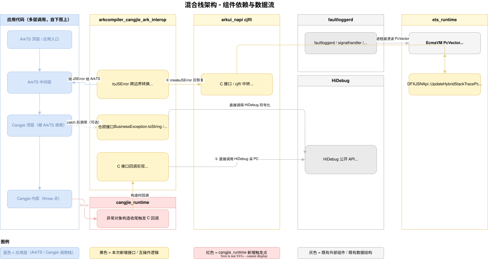
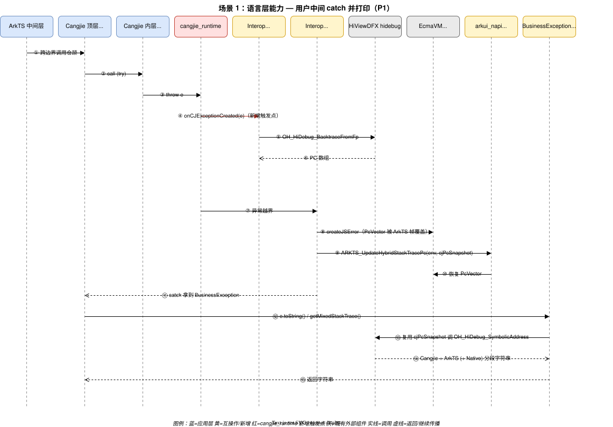
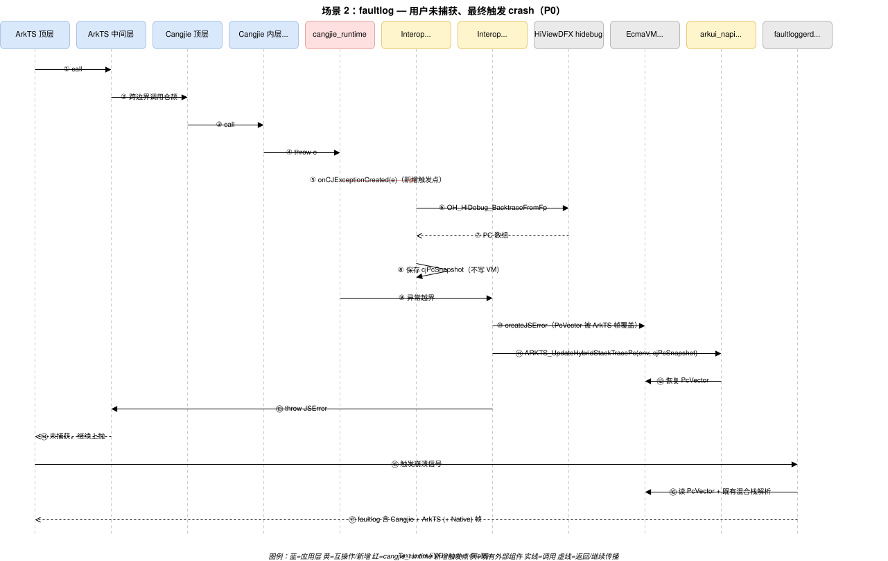

# 混合栈支持仓颉 - 架构设计

> 配套需求文档：[hybridstack_support_cangjie_design.md](./hybridstack_support_cangjie_design.md)
> 适用分支：`feat/hybridstack-redesign`
> 状态：草案 v3（Draft）

## 1. 设计目标对齐

应用形态前提：**ArkTS 为应用入口**，通过互操作调用仓颉模块；仓颉抛出的异常在跨边界时由互操作 `toJSError` 转为 `JSError`，由 ArkTS 侧捕获或继续向上传播。本设计不涉及「纯仓颉应用入口」场景（该场景下未捕获仓颉异常的处理由 ability_runtime 经既有 `CJUncaughtExceptionInfo` 完成，与混合栈无关）。

| 优先级 | 目标 | 验证场景 |
| ------ | ---- | -------- |
| P0 (主要) | faultlog 中能稳定显示仓颉栈帧（异常自仓颉抛出，未被 ArkTS 捕获，最终触发进程崩溃） | ArkTS 入口 → 调用仓颉 → 仓颉 throw → ArkTS 未捕获 → 进程崩溃 → faultlog 含仓颉帧 |
| P1 (次要) | 仓颉侧 `BusinessException.toString()` / `getMixedStackTrace()`（仓颉 API）至少呈现「Cangjie + ArkTS」混合栈 | 仓颉 try/catch 后调用 toString 打印 |
| P2 (可选) | 上述混合栈进一步包含 Native (C/C++) 帧 | 同上 |

## 2. 现状、目标差距与关键技术约束

### 2.1 现有 master 主干实现

当前主干（`feat/mixed-exception-stack-stitching` 已合入路径）在异常跨边界点进行**字符串拼接**式的混合栈输出：

```mermaid
flowchart LR
    CJBot["Cangjie 内层（throw 点）"] -->|throw| CR[cangjie_runtime]
    CR -->|unwind 至边界| TJ["Interop toJSError"]
    TJ -->|createJSError| VM["EcmaVM PcVector（被 ArkTS 帧覆盖）"]
    TJ -->|@FastNative foreign 直链 libohhidebug| HVDFX["HiViewDFX hidebug 内部接口"]
    HVDFX -->|OH_HiDebug_BacktraceFromFp / SymbolicAddress| TJ
    TJ -->|toString 时拼接 [HiDebug] frames=N + legacy| Biz["BusinessException 字符串"]
    VM -.->|崩溃信号读 PcVector| FL[faultloggerd faultlog]
    classDef cur fill:#fff5cc,stroke:#d4a017;
    class TJ,Biz cur;
```

要点：
- HiViewDFX hidebug 采集与符号化已经**通过 `external_deps = [ "hiviewdfx_hidebug:libohhidebug" ]` 内部接口直链**完成，不再使用 dlopen，也不存在本仓库自有的 C++ 桥接层；
- `BusinessException.toString()` 在用户 catch 路径下能输出「HiDebug + legacy」字符串；
- faultlog 路径仍只能落到 `EcmaVM::PcVector` 中由 `createJSError` 覆盖后的 ArkTS 帧，**仓颉帧丢失**。

### 2.2 现状与设计目标的差距

| 目标 | 现状 | 差距 |
| ---- | ---- | ---- |
| P0 faultlog 含仓颉帧 | faultlog 仅含 `createJSError` 写入的 ArkTS 帧 | **完全未达成**：仓颉帧从未到达 `EcmaVM::PcVector`，崩溃栈无仓颉信息 |
| P1 仓颉 API 混合栈 | `BusinessException.toString()` 拼接「HiDebug + legacy stitched」 | **形式达成、内容近似**：依赖 `toJSError` 时 `fp` 仍在仓颉一侧的窗口，对真正越界后 catch 的场景不稳定 |
| P2 含 Native 帧 | 通过 `classifyFrame` 启发式分段，覆盖度依赖符号匹配 | 部分达成，质量取决于 HiDebug 符号化输出 |

### 2.3 关键技术约束（用于审查决策）

1. **`EcmaVM::PcVector` 单例语义**：`EcmaVM` 上仅保留最近一次写入的 PC 向量，`createJSError` 会以当前 ArkTS 调用栈覆盖。任何「先把仓颉 PC 写入 PcVector → 再创建 JSError」的顺序都会被覆盖。
2. **仓颉栈帧的有效窗口极短**：`throw e` 触发后 cangjie_runtime 立即 unwind；等到 `toJSError` 时仓颉栈已销毁，必须在**异常对象构造瞬间**完成 PC 采集，否则采到的是越界后的栈而非 throw 点。
3. **HiViewDFX hidebug 内部接口可用**：`OH_HiDebug_CreateBacktraceObject` / `OH_HiDebug_BacktraceFromFp` / `OH_HiDebug_SymbolicAddress` 通过 `hiviewdfx_hidebug:libohhidebug` 内部接口直链调用，不引入额外私有依赖。
4. **`BusinessException` 是仓颉 API**：`toString()` / `getMixedStackTrace()` / `getCrossMessage()` 由仓颉代码实现并被仓颉用户代码调用，不是 ArkTS 接口；ArkTS 侧拿到的是 `JSError`，需经互操作再次桥回仓颉对象后才能调用上述方法。
5. **互操作不直连 ets_runtime**：互操作对 ets_runtime 的所有调用统一经 `arkui_napi/interfaces/inner_api/cjffi/ark_interop` 中转。
6. **二进制兼容性**：`BusinessException` 公开 API 与错误码 34300001-34300008 必须保持兼容。

## 3. 方案核心设计抉择

### 3.1 PC 采集时机：边界采集 vs. 构造期回调

基于 §2.1 的现状（仅在 `toJSError` 边界采集），核心抉择是是否将 PC 采集前移至异常对象构造瞬间：

| 候选 | 触发时机 | 能否覆盖 P0 | 能否覆盖 P1 | 结论 |
| ---- | ---- | ---- | ---- | ---- |
| B. 维持现状：仅在互操作边界 `toJSError` 中采集 | 异常跨边界时 | ✗ 仓颉栈已 unwind，采不到 throw 点 | △ 当前主干已实现「近似」字符串拼接，但 throw 点信息不稳定 | 现状，无法升级到 P0 |
| **C. cangjie_runtime 新增 `onCJExceptionCreated` 回调** | **异常对象构造瞬间** | ✓ 仓颉栈仍在；保存 PC 快照，跨边界后恢复写入 PcVector | ✓ catch 路径同样触发，PC 来自 throw 点 | **采用** |

**结论**：本方案**主动要求 cangjie_runtime 新增一个异常构造期回调** `onCJExceptionCreated`。这是在「方案设计阶段明确提出的运行时改动」，与边界采集方案完全独立。

### 3.2 PC 采集与「toJSError 覆盖」的处理顺序

首先复述 §2 中 `createJSError` 的存在原因：仓颉 throw 出的 `BusinessException` 不是 ArkTS 可识别的 `Error`，互操作必须在跨边界时**包装一个 ArkTS 侧的 `JSError`**（即调用 `napi_create_error` / `napi_throw`，落地为 ets_runtime 的 `createJSError`）抛给 ArkTS，让 ArkTS 用户与 ArkTS VM 的 `try/catch`、`Promise.reject`、未捕获异常上抛链能正常工作。**这一步是互操作语义的硬约束**，不能省略，但其副作用是 `EcmaVM::PcVector` 被 ArkTS 当前调用栈覆盖。

由此本设计采用**先保存、后恢复**的顺序，避免与 `createJSError` 的覆盖动作竞争：

- **阶段 ①（异常构造期，运行时回调中）**：互操作回调直接调用 HiViewDFX hidebug 采集仓颉 PC → 备份至 `SharedException.cjPcSnapshot`，**不写入**当前 vm PcVector。
- **阶段 ②（互操作 `toJSError` 内）**：`createJSError` 创建新 JSError 并覆盖 PcVector → **立即**经 cjffi 调 `ARKTS_UpdateHybridStackTracePc(env, cjPcSnapshot)`，用前面保存的仓颉 PC 快照恢复 PcVector。后续 faultlog 与仓颉 API 读到的就是恢复后的 PcVector。

每个 `EcmaVM` 自带 PcVector，恢复操作只作用于当前 vm，天然支持多 VM / worker / 嵌套 JSRuntime。

## 4. 总体架构

### 4.1 组件依赖（仅含本方案相关交互）



> 源文件：[hybridstack_architecture_design.drawio](./hybridstack_architecture_design.drawio)（draw.io 可编辑）
>
> 布局说明：
> - 应用代码列**自下而上**绘制——`Cangjie 内层（throw 点）` 位于顶部，与 `cangjie_runtime` 同行直连，避免线条折回；
> - `arkui_napi cjffi` 仅保留 `ARKTS_UpdateHybridStackTracePc`，`arkcompiler_cangjie_ark_interop` 直接连到 `HiDebug` 采集与符号化；
> - `HiDebug` 与 `faultloggerd` 是两个独立的外部组件框，互不合并。
>
> 图例：
> - **蓝色** = 应用层（ArkTS / Cangjie 调用栈）；
> - **黄色** = 互操作逻辑 / 新增接口；
> - **红色** = 本设计要求 cangjie_runtime 新增的触发点；
> - **灰色** = 既有外部组件 / 既有数据结构（包括 `EcmaVM PcVector`），仅依赖其行为；
> - **虚线箭头**（`CJTop ⤏ Biz`）表示用户态可选行为：用户 catch 后才会调用仓颉 API；若用户不 catch，异常继续沿 `toJSError` → ArkTS 上抛，最终走 faultlog 场景，本步骤不发生。
>
> 术语对齐：图中标注的「HiDebug」对应 `hiviewdfx_hidebug:libohhidebug` 内部接口（HiViewDFX 子系统提供），全文统一使用 "HiViewDFX hidebug"。

### 4.2 控制流时序

按 §2 的两类用户可见能力分别给出时序：

- **场景 1：语言层能力 — 用户在中间层 catch 并打印**（对应 P1，仓颉 API 输出混合栈）
- **场景 2：faultlog — 用户未 catch、最终触发 crash**（对应 P0，faultlog 含仓颉帧）

两个时序图通过 drawio MCP 单独建模、对齐主架构图的组件命名与配色。

#### 4.2.1 场景 1：语言层能力 — 用户中间 catch 并打印（P1）



> 源文件：[hybridstack_seq_lang_catch.drawio](./hybridstack_seq_lang_catch.drawio)
>
> 关键点：异常构造期通过 `onCJExceptionCreated` 回调采集仓颉 PC 并保存 `cjPcSnapshot`；用户在 catch 后调用 `BusinessException.toString()` 时，直接对 `cjPcSnapshot` 经 HiViewDFX hidebug 符号化，得到 `Cangjie + ArkTS (+ Native)` 三段字符串。

#### 4.2.2 场景 2：faultlog — 未捕获触发 crash（P0）



> 源文件：[hybridstack_seq_faultlog.drawio](./hybridstack_seq_faultlog.drawio)
>
> 关键点：异常构造期保存 `cjPcSnapshot`；`toJSError` 在 `createJSError` 后立即经 `ARKTS_UpdateHybridStackTracePc` 把仓颉 PC 写回 `EcmaVM::PcVector`。ArkTS 未捕获、信号触发后，faultloggerd 读到的就是恢复后的 PcVector，最终 faultlog 含仓颉帧。

#### 4.2.3 ArkTS 自身抛出异常（无仓颉参与）

互操作完全不参与；ets_runtime 自身在 `JSError` 创建时已写入 PcVector，faultlog 走原路径，无新增逻辑。

## 5. 涉及组件与改动范围

> 原则：仅对**本次需要改动**的组件展开接口；其余组件只描述其在本方案中的**行为角色**。

### 5.1 需要改动的组件

#### 5.1.1 cangjie_runtime（新增异常构造期回调）

新增导出，在仓颉异常对象构造收尾处同步调用，单次 throw 仅触发一次：

```c
typedef void (*OnCJExceptionCreatedFn)(void* cjException);
MRT_EXPORT void RegisterCJExceptionCreatedHandler(OnCJExceptionCreatedFn fn);
```

#### 5.1.2 arkcompiler_ets_runtime（DFXJSNApi 新增 1 个 API）

```c++
// 将 PC 数组直接写入指定 vm 的 PcVector，覆盖原值
void DFXJSNApi::UpdateHybridStackTracePc(const EcmaVM* vm, void** data, int size);
```

仅此一个新增接口，既有 `GetHybridStackTrace` / `SymbolicAddress` 不动。**该 API 不直接对互操作开放**，由 arkui_napi cjffi 模块封装中转。

#### 5.1.3 arkui_napi cjffi（新增 1 个中转函数）

互操作不直接链接 `libark_jsruntime`；对 ets_runtime 的 PcVector 写入仍统一经 `interfaces/inner_api/cjffi/ark_interop` 中转。本设计在该模块仅新增 1 个函数：

```c
// arkui_napi/interfaces/inner_api/cjffi/ark_interop/ark_interop_napi.h（新增）
// 将 PC 数组写入当前 napi_env 对应 vm 的 PcVector
//    内部：解出 EcmaVM → DFXJSNApi::UpdateHybridStackTracePc
int ARKTS_UpdateHybridStackTracePc(napi_env env, void** frames, int count);
```

PC 采集与符号化不再新增 ARKTS 中转，由本仓库通过 HiViewDFX hidebug 内部接口直链完成。

#### 5.1.4 arkcompiler_cangjie_ark_interop（本仓库）

沿用主干 `feat/mixed-exception-stack-stitching` 的纯仓颉直链格局（`@FastNative foreign` 直链 `hiviewdfx_hidebug:libohhidebug`，无 dlopen、无自有 C++ 桥接层），在此基础上接入运行时回调与 `cjffi` 中转：

| 文件 | 改动 |
| ---- | ---- |
| `ohos/ark_interop/js_module.cj` | 初始化路径调用 `RegisterCJExceptionCreatedHandler` 注册 `onCJExceptionCreated` 回调 |
| `ohos/ark_interop/js_exception.cj` | `SharedException` 增加字段 `cjPcSnapshot: ?Array<UIntNative>`；异常构造期回调中只保存快照、不更新 VM；`toJSError` 在 `createJSError` 之后立即调用 `ARKTS_UpdateHybridStackTracePc` 用快照恢复 PcVector |
| `ohos/business_exception/business_exception.cj` | `toString` / `getMixedStackTrace` 复用 `cjPcSnapshot` + 既有 `hidebug_backtrace.cj` 的 `symbolicateAll` / `classifyFrame`；结果缓存到 `cachedHybridTrace: ?String` |
| `ohos/business_exception/hidebug_backtrace.cj` | 既有，无结构改动；新增「按外部 PC 数组直接符号化」的入口（场景 1 不再依赖运行时 fp 重新采集） |
| `ohos/business_exception/ark_interop_ffi.cj`（新增） | `@C foreign` 声明：`ARKTS_UpdateHybridStackTracePc`（仅此 1 个新 cjffi 符号；HiViewDFX hidebug 符号声明已在 `hidebug_backtrace.cj`） |

**onCJExceptionCreated 回调内部行为**：
1. 直接通过 HiViewDFX hidebug 内部接口（`OH_HiDebug_BacktraceFromFp`）采集当前线程仓颉 PC 帧；
2. 备份 PC 数组到对应 `SharedException.cjPcSnapshot`；
3. 不更新当前 vm PcVector，留待 `toJSError` 后统一恢复。

**仓颉 API 符号化路径**：`BusinessException.toString` / `getMixedStackTrace` 基于保存的 `cjPcSnapshot` 直接调用 HiViewDFX hidebug 内部接口完成符号化，**不依赖 `napi_get_hybrid_stack_trace`**，也不重复采集。

### 5.2 不改动、仅依赖其既有行为的组件

| 组件 | 在本方案中的角色 | 是否改动 |
| ---- | ---- | ---- |
| arkui_napi cjffi（除 §5.1.3 新增 1 个中转外） | 既有 ark_interop 系列封装继续承担 `napi_env ↔ EcmaVM` 桥接 | 否 |
| ets_runtime（除 DFXJSNApi 新增外） | `EcmaVM` 持有 PcVector；faultlog 路径既有的混合栈解析继续生效 | 否 |
| HiViewDFX hidebug | 提供栈回溯（PC 采集）与符号化内部接口，由互操作直接直链调用 | 否 |
| faultloggerd / dfx_signalhandler / dfx_dump_catcher | 进程崩溃时读 vm PcVector 落 faultlog | 否 |
| hilog / hisysevent | 日志通道 | 否 |

## 6. 仓库内目录规划

```
arkcompiler_cangjie_ark_interop/
├── doc/
│   ├── hybridstack_support_cangjie_design.md
│   ├── hybridstack_architecture_design.md         # 本文件
│   ├── hybridstack_architecture_design.drawio     # 主架构图源文件
│   ├── hybridstack_seq_lang_catch.drawio          # 时序图：场景 1 语言层 catch 打印
│   └── hybridstack_seq_faultlog.drawio            # 时序图：场景 2 faultlog
├── ohos/
│   ├── ark_interop/
│   │   ├── js_exception.cj                        # 改：SharedException.cjPcSnapshot + toJSError 恢复
│   │   └── js_module.cj                           # 改：注册 onCJExceptionCreated
│   └── business_exception/
│       ├── business_exception.cj                  # 改：toString / getMixedStackTrace 复用 cjPcSnapshot
│       ├── hidebug_backtrace.cj                   # 既有：HiViewDFX hidebug 直链；新增按外部 PC 符号化入口
│       └── ark_interop_ffi.cj                     # 新增：ARKTS_UpdateHybridStackTracePc 的 @C foreign 声明
└── test/hybridstack/
```

> 本仓库**不**新增 C/C++ 桥接层；HiViewDFX hidebug 走 `external_deps` 内部接口直链，PcVector 写入经 arkui_napi cjffi 中转。

## 7. 关键接口（仅列出本设计新增）

```c++
// ets_runtime（新增，不直接对互操作开放）
void DFXJSNApi::UpdateHybridStackTracePc(const EcmaVM* vm, void** data, int size);
```

```c
// arkui_napi/interfaces/inner_api/cjffi/ark_interop/ark_interop_napi.h（新增 1 个中转）
int ARKTS_UpdateHybridStackTracePc(napi_env env, void** frames, int count);
```

```cangjie
// 本仓库 ohos/business_exception/business_exception.cj（仓颉 API，沿用既有签名）
public class BusinessException <: Exception {
    // 既有：用户在 catch 后调用；本设计将其切换为基于 cjPcSnapshot 的稳定路径
    public override func toString(): String { ... }
    public func getMixedStackTrace(): String { ... }
}
```

> cangjie_runtime 侧的回调注册接口（用于触发 `onCJExceptionCreated`）由 cangjie_runtime owner 决定 ABI 形态，本文档不再列出占位签名，避免与最终落地不一致。

## 8. 性能与可优化点

| 项 | 描述 | 状态 |
| -- | ---- | ---- |
| PC 采集成本 | 异常构造期回调中调用 HiViewDFX hidebug 一次，O(n)，n ≈ 数十帧；**不写 VM** | 启用 |
| PC 写入 PcVector 成本 | **仅在 `toJSError` 后写一次**（恢复 cjPcSnapshot），异常构造期不写 | 启用 |
| 符号化结果缓存 | 仓颉 API 结果缓存到 `BusinessException.cachedHybridTrace`，重复 `toString()` 不重算 | 启用 |
| FFI 开销 | 仅异常路径触发，频次低 | 启用 |

## 9. 兼容性 / 风险

1. **`onCJExceptionCreated` 落地分级降级方案**（基于现状的可控退化）：
   - **L0（满足 P0）**：cangjie_runtime 接受新增构造期回调 + ets_runtime/arkui_napi 接受 PcVector 写入接口 → faultlog 含仓颉帧，仓颉 API 含完整三段。
   - **L1（仅满足 P1）**：cangjie_runtime 回调被拒，但 ets_runtime/arkui_napi 接口落地 → 退化为现状的「`toJSError` 边界采集 + 立即写 PcVector」方案，throw 点信息与现状一致（不稳定但 faultlog 至少有非空仓颉帧）。
   - **L2（仅维持现状）**：ets_runtime/arkui_napi 接口都被拒 → 退化为主干 `feat/mixed-exception-stack-stitching` 的纯字符串拼接方案（仓颉 API 输出「HiDebug + legacy」），faultlog 不含仓颉帧。
2. **ets_runtime 接口落地**：`DFXJSNApi::UpdateHybridStackTracePc` 必须被接受。若拒绝，按 L2 退化。
3. **arkui_napi cjffi 中转函数落地**：新增 `ARKTS_UpdateHybridStackTracePc` 必须被 napi 团队接受。
4. **多 VM / worker**：每个 vm 独立写入与恢复自身 PcVector，无跨 vm 状态。
5. **二进制兼容**：`BusinessException` 公开 API 与错误码不变；新增字段位于 `SharedException` / 内部，不破坏 ABI。
6. **API Level**：新增仓颉 API 需打 `@APILevel` 装饰器（参考 `ohos/labels/api_level.cj`）。

## 10. 端到端验证策略

| 验证 | 方式 | 工具 |
| ---- | ---- | ---- |
| 单元 | `test/hybridstack/` 下 `cjpm test` | `.agents/skills/cjpm-build` |
| 集成构建 | 替换兼容 SDK 产物后 hvigor 打包 VerifyBuild | `.agents/skills/verifybuild-e2e-validation` |
| Faultlog | ArkTS 入口调用仓颉 throw → ArkTS 不 catch → 设备 hilog + faultlog 抓取，确认仓颉 PC 出现在 `=====Hybrid Stack=====` 段 | 手工 |
| 仓颉 API | 仓颉 try/catch 后调用 `e.toString()` / `e.getMixedStackTrace()`，输出含 Cangjie / ArkTS / Native 三段 | 手工 + 单测 |

## 11. 与现状方案的差异

| 维度 | 现状（master 字符串拼接） | 本设计 |
| ---- | ---- | ---- |
| Faultlog 仓颉栈来源 | 无（PcVector 始终被 ArkTS 帧覆盖） | ets_runtime PcVector，由 cangjie_runtime 新增回调保存快照，并在 `toJSError` 后经 cjffi 恢复写入 |
| 跨边界 PC 覆盖处理 | 无 | `toJSError` 内立即用 `cjPcSnapshot` 恢复 |
| 仓颉 API 混合栈 | `BusinessException.toString()` 拼接「HiDebug + legacy」字符串，throw 点信息不稳定 | `BusinessException.toString()` 基于 `cjPcSnapshot` 直接调用 HiViewDFX hidebug 符号化，throw 点稳定 |
| 多 VM 支持 | 未考虑 | 每 vm 独立，天然支持 |
| 对仓颉运行时依赖 | 仅 throw / catch | **明确要求新增一个构造期回调**，PC 采集仍由互操作直接通过 HiViewDFX hidebug 完成 |
| 上游协作面 | interop 单仓 | cangjie_runtime（+1 回调）+ ets_runtime（+1 API）+ arkui_napi cjffi（+1 中转）+ interop |

## 12. 后续工作

1. 与 cangjie_runtime owner 对齐 `onCJExceptionCreated` 回调（触发点与 ABI）。
2. 与 ets_runtime owner 对齐 `DFXJSNApi::UpdateHybridStackTracePc`。
3. 与 arkui_napi owner 对齐 `ARKTS_UpdateHybridStackTracePc` 中转函数（写 PcVector）。
4. 实施 plan：[`docs/superpowers/plans/2026-04-24-hybridstack-redesign.md`](../docs/superpowers/plans/2026-04-24-hybridstack-redesign.md)