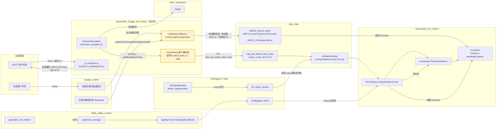
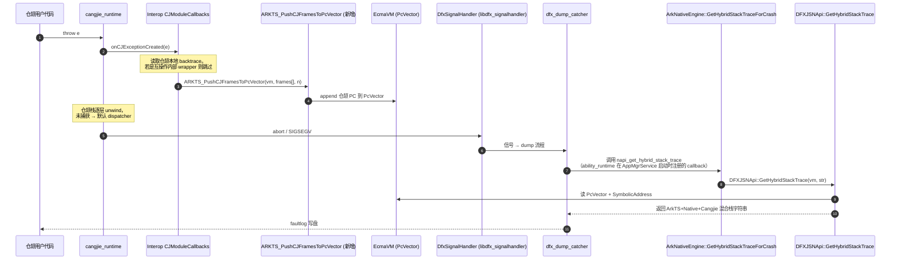
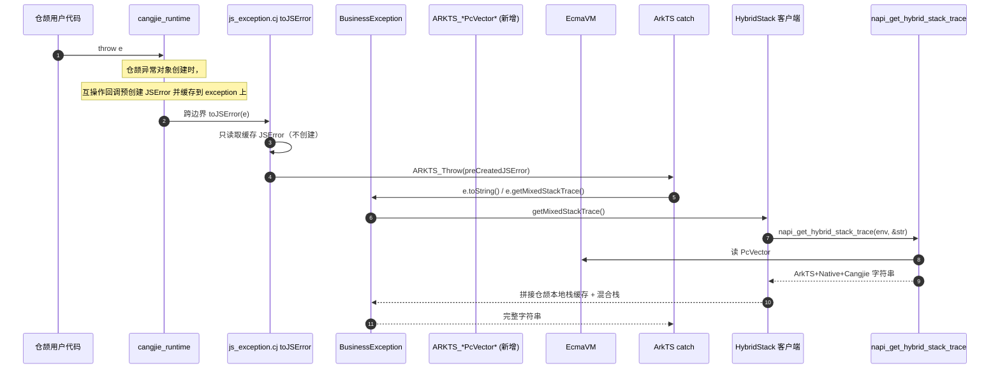

# 混合栈支持仓颉 - 架构设计

> 配套需求文档：[hybridstack_support_cangjie_design.md](./hybridstack_support_cangjie_design.md)
> 适用分支：`feat/hybridstack-redesign`
> 状态：草案 v1（Draft）

## 1. 设计目标对齐

| 优先级 | 目标 | 验证场景 |
| ------ | ---- | -------- |
| P0 (主要) | faultlog 中能稳定显示仓颉栈帧，无论异常源自仓颉侧抛出还是 ArkTS 侧抛出 | 信号触发 crash → faultloggerd 解析出仓颉帧 |
| P1 (次要) | 语言层 `Exception.toString()` 与 `getMixedStackTrace()` 至少呈现「仓颉 + ArkTS」混合栈 | 应用 `try/catch` 后打印异常 |
| P2 (可选) | 语言层混合栈进一步包含 Native (C/C++) 帧 | 同上 |

## 2. 关键约束与重要事实校正

1. **PC Array 单例语义**：`EcmaVM` 上仅保留最近一次 ArkTS Error 创建时刻的 PC 向量，后续任何 Error 创建都会覆盖（参见 `ets_runtime/ecmascript/napi/dfx_jsnapi.cpp:1234` 的 `GetHybridStackTrace`）。
2. **互操作侧当前实现问题**：`ohos/business_exception/business_exception.cj` 与 `ohos/ark_interop/js_exception.cj` 现状是在 `toJSError()` 边界构造新的 ArkTS Error，覆盖 PC Array，是当前 faultlog 丢失仓颉帧的根因。本方案要求将 JSError 的创建时机前移到「仓颉异常对象创建时」。
3. **不引入仓颉自己抓取 C 栈的能力**：Native 栈仅依赖 ets_runtime / faultloggerd 已有的 `GetHybridStackTrace` 解析能力。
4. **二进制兼容性**：`BusinessException` 类公开 API（`getCrossMessage` / `getMixedStackTrace` / 错误码 34300001-34300008）必须保持兼容。
5. **`ARKTS_UpdateStackInfo` 的真实语义**：经核对 `ets_runtime/ecmascript/js_thread.h` 与 `arkui_napi` 实现，现行 `opKind` 仅有 `0=SwitchToSubStackInfo`、`1=SwitchToMainStackInfo`，其作用是切换 fiber/线程的栈上下文（`stackLimit`/`leaveFrame`），**并不会直接写入 `PcVector`**。`PcVector` 实际由 ets_runtime 在异常对象构造路径上 `BacktraceHybrid()` 产生。本设计的「向 PcVector 注入仓颉 PC」必须通过新增/扩展接口实现，可选实现路径见 §4.2.4，**默认采用「快照-恢复」回退方案**（不依赖上游新 opKind）。
6. **JSEnv 类型**：`JSEnv = IntNative`（参见 `ohos/ark_interop/jscontext.cj`），是裸指针值，不是带方法的类。FFI 调用时直接当作 `CPointer<Unit>` 使用，避免出现「`env.rawPointer()`」之类的伪 API。

## 3. 总体架构

### 3.1 周边组件依赖



> 图例：黄色节点为本设计在 `cangjie_ark_interop` 内**新增或重构**的组件；其余为已有外部依赖。

### 3.2 控制流时序

#### 场景 A：仓颉抛出未捕获异常 → faultlog



#### 场景 B：仓颉抛出异常被 ArkTS 捕获并打印



#### 场景 C：ArkTS 抛出异常（无仓颉参与）

不变更现有路径：ArkTS 自身的 `JSError` 创建已经写入 PcVector，faultlog 直接由 ets_runtime 输出，互操作侧零参与。

## 4. 模块设计

### 4.1 仓库内目录规划

```
arkcompiler_cangjie_ark_interop/
├── doc/
│   ├── hybridstack_support_cangjie_design.md    # 需求文档（已存在）
│   └── hybridstack_architecture_design.md       # 本文件
├── ohos/
│   ├── ark_interop/
│   │   ├── js_exception.cj            # 重构：toJSError 不再 createJSError（主路径）
│   │   └── js_module.cj               # 重构：注册“异常构造期回调”
│   ├── business_exception/
│   │   └── business_exception.cj      # 重构：toString/getMixedStackTrace 调用 HybridStack
│   └── hybrid_stack/                  # 新增子模块
│       ├── hybrid_stack.cj            # 仓颉侧 API 封装
│       └── hybrid_stack_ffi.cj        # @C foreign 声明
├── frameworks/native/hybrid_stack/    # 新增 C++ 桥接
│   ├── hybrid_stack_bridge.cpp
│   ├── hybrid_stack_bridge.h
│   └── BUILD.gn
├── interfaces/inner_api/hybrid_stack/ # 对外暴露给 ability_runtime（可选）
│   └── hybrid_stack_inner.h
└── test/
    └── hybridstack/                   # 单测 + 端到端验证脚本
```

### 4.2 关键接口

#### 4.2.1 C 桥接（新增 `frameworks/native/hybrid_stack/hybrid_stack_bridge.h`）

```cpp
// 被仓颉侧通过 @C foreign 调用
// 返回值: 0=成功, 非 0=错误码
extern "C" int CJ_HybridStack_GetTrace(napi_env env,
                                       char* buf,
                                       size_t bufLen,
                                       size_t* outLen);

// 仅在仓颉异常对象创建回调中调用（场景 A/B 前置）
extern "C" int CJ_HybridStack_PreCreateJSErrorAndPushFrames(unsigned long long vmAddr,
                                                             void* cjException,
                                                             void* frames,
                                                             size_t frameCount);
```

实现内部转调：
- `CJ_HybridStack_GetTrace` → `napi_get_hybrid_stack_trace`（语言层路径）
- `CJ_HybridStack_PreCreateJSErrorAndPushFrames` → `ARKTS_PushCJFramesToPcVector + ARKTS_PreCreateJSError`（faultlog/语言层共用前置路径）

#### 4.2.2 仓颉侧 API（新增 `ohos/hybrid_stack/hybrid_stack.cj`）

```cangjie
public class HybridStack {
    public static func getTrace(env: JSEnv): String { ... }
    // 在仓颉异常构造点由互操作回调内部使用
    static func pushCangjieFrames(vmAddr: UInt64, subStackInfo: CPointer<Unit>): Unit { ... }
}
```

#### 4.2.3 重构点

| 文件 | 现状 | 改动 |
| ---- | ---- | ---- |
| `ohos/ark_interop/js_exception.cj:145-155 createJSError` | 每次跨边界都创建 ArkTS Error，覆盖 PcVector | 主路径改为：`toJSError` 不再调用 `createJSError`，只读取「仓颉异常构造阶段由互操作回调创建并缓存」的 JSError 并抛出。`createJSError` 仅保留为兼容兜底（缓存缺失时启用并打告警日志）。 |
| `ohos/ark_interop/js_module.cj:36-43 CJModuleCallbacks` | 仅有 `throwJSError` 回调 | 新增 `onCJExceptionCreated` 回调，由 cangjie_runtime 在异常对象构造时回调互操作：完成「预创建 JSError + 绑定原始仓颉异常 + 写入/追加 PcVector」。这是本方案主路径。 |
| `ohos/business_exception/business_exception.cj:152-178 getMixedStackTrace` | 自行拼接仓颉 + ArkTS 字符串 | 调用 `HybridStack.getTrace(env)` 获取 ArkTS+Native+Cangjie 完整字符串，与本地仓颉帧合并去重 |

#### 4.2.4 PcVector 注入与保护策略

现行 `ARKTS_UpdateStackInfo(opKind=0/1)` 只切换 fiber 栈上下文，不能直接写 PcVector。本设计采用 **「快照-恢复」+ 仓颉 PC 直注** 的组合策略，**不依赖上游新增 opKind**：

1. **PcVector 快照接口（新增 cjffi C API）**
   - `ARKTS_GetPcVectorSnapshot(vmAddr, **dataOut, *sizeOut)`：读 `vm->GetPcVectorData()` / `GetPcVectorSize()`，复制一份返回。
   - `ARKTS_RestorePcVectorSnapshot(vmAddr, *data, size)`：将快照写回 vm 内部的 PcVector 字段。
   - 实现位置：`arkui_napi/native_engine/impl/ark/ark_native_engine.cpp` 暴露 + `ets_runtime` 提供新的 `JSNApi::SetPcVector(vm, ...)` 内部接口。**这是本设计唯一对上游的硬依赖**。

2. **仓颉 PC 直注接口（新增 cjffi C API）**
   - `ARKTS_PushCJFramesToPcVector(vmAddr, frames[], frameCount)`：将仓颉 backtrace 帧（PC 数组）追加到 vm 的 PcVector。同样需要在 ets_runtime 暴露 `JSNApi::AppendPcVector`。

3. **使用模式（与原始思路一致）**：

| 场景 | 处理 |
| ---- | ---- |
| 仓颉异常对象创建（场景 A/B 共同前置） | 回调中预创建 JSError，并同时执行 `ARKTS_PushCJFramesToPcVector` 直注 |
| 跨边界 `toJSError`（场景 B） | 仅提取已缓存 JSError 并抛出；不再创建新 Error |
| 兼容兜底 | 若缓存缺失，才走 `createJSError` + `Snapshot/Restore`，并记录告警用于追踪构造回调缺失 |

> 如果上游短期无法接受 `SetPcVector/AppendPcVector` 内部接口，**最终回退**：仅做语言层（P1/P2 目标）；faultlog 仓颉栈帧暂以「business_exception.message + stitched 文本」形式呈现（旧方案能力的子集），等价于不解锁 P0。该回退会在 plan Task 0 的上游对齐结果中明确选定。

## 5. 性能与可优化空间

| 项 | 描述 | 状态 |
| -- | ---- | ---- |
| **符号化结果缓存** | 语言层 `getMixedStackTrace` 解析后缓存到 `BusinessException` 实例字段 `cachedHybridTrace: ?String`；faultlog 路径获取同一 vmAddr 的结果时，在 C++ 桥接层额外增一层 `static thread_local std::unordered_map<uint64_t, std::string>` 缓存，赋值于 `napi_get_hybrid_stack_trace` 之后。Plan **Task 5b** 为实现优化。 | v1 提供实例字段，thread_local 缓存作为选项任务 |
| **PcVector 快照成本** | 仅在 wrapper 创建场景调用，O(n) n=PcVector size，估计 < 1KB | 启用 |
| **跨语言 FFI 调用** | `CJ_HybridStack_GetTrace` 仅在异常路径触发，频次低 | 启用 |

## 6. 兼容性 / 风险

1. **PcVector 读写接口的上游依赖**：`SetPcVector/AppendPcVector` 必须落地到 ets_runtime + arkui_napi。Plan Task 0 spike 决定上游接受度；若拒绝，启用 §4.2.4 末尾的最终回退（仅 P1/P2，不解锁 P0）。
2. **回调时序（硬约束）**：cangjie_runtime 必须在异常**对象**构造时（而非 throw 时）回调，否则本方案主路径无法成立。`toJSError` 不负责创建 JSError，只负责取回预创建对象并抛出。若构造回调缺失，仅能进入兼容兜底路径（`createJSError + Snapshot/Restore`），不作为目标实现。
3. **多 VM / 多 worker 安全**：每个 EcmaVM 独立 PcVector；`ALL_RUNTIMES_` map（`jscontext.cj`）按 `vmAddr` 索引，访问点已在仓颉侧 `synchronized`。新增的 `pushCangjieFrames`/`getTrace` FFI 调用必须在持有对应 `JSContext` lock 的上下文内执行；C++ 侧 `ARKTS_UpdateStackInfo` 与新增 `Append/SetPcVector` 实现需要在 ets_runtime 侧使用 `JSNApi::EnterEnv` 切换正确 vm。
4. **跨 VM 异常传播**：禁止在 worker A 抛出、被 worker B 捕获的场景下复用 PcVector；wrapper Error 创建前必须断言 `vmAddr == pendingException 的 vm`。
5. **API Level**：新增仓颉 API 需打 `@APILevel` 装饰器（参考 `ohos/labels/api_level.cj`）。
6. **wrapper 识别**：`pendingJSError` 复用条件依赖 `refEq(sharedException.mixedException, exception)`；为避免 user 代码自行 throw 同一对象时被错误复用，新增「互操作内部生成」标记字段（如 `SharedException.fromInteropBoundary: Bool`）作为额外条件。

## 7. 端到端验证策略

| 验证 | 方式 | 工具 |
| ---- | ---- | ---- |
| 单元 | `test/hybridstack/` 下 `cjpm test` | `.agents/skills/cjpm-build` |
| 集成构建 | 替换兼容 SDK 产物后 hvigor 打包 VerifyBuild | `.agents/skills/verifybuild-e2e-validation` |
| Faultlog 现场 | 设备 hilog + faultlog 抓取，确认仓颉 PC 出现在 `=====Hybrid Stack=====` 段 | 手工 |
| 语言层 | `try{ ... } catch(e){ console.error(e.toString()) }` 输出包含三段：CJ frames / ArkTS frames / Native frames | 手工 + 单测 |

## 8. 与历史方案的差异

| 维度 | 旧 stitching 方案（`feat/mixed-exception-stack-stitching`） | 本设计 |
| ---- | --------------------------------------------------------- | ------ |
| Faultlog 仓颉栈来源 | 互操作侧自行 stitch 字符串注入 faultlog | 复用 ets_runtime PcVector + DFXJSNApi 已有路径 |
| ArkTS Wrapper 与 PC 覆盖 | 未处理，依赖 stitching 弥补 | JSError 创建时机前移到仓颉异常构造点；`toJSError` 不再创建，默认无覆盖（仅保留兼容兜底） |
| 语言层混合栈 | 字符串拼接 | 调用 `napi_get_hybrid_stack_trace` 统一来源 |
| 对仓颉运行时依赖 | 强（自带 HiDebug backtrace 抓取） | 弱（仅一个异常构造回调） |
| 上游协作面 | 仓颉运行时 + interop | ets_runtime opKind + interop（cangjie_runtime 异常回调可选） |

## 9. 后续工作

1. 与 ets_runtime / arkui_napi owner 对齐 `PushCJFramesToPcVector`、`PreCreateJSError`、`Snapshot/Restore PcVector` 接口。
2. 与 cangjie_runtime owner 对齐异常构造回调点，并补齐“构造期创建 JSError + 绑定仓颉异常对象”的运行时调用点。
3. 实施 plan：[`docs/superpowers/plans/2026-04-24-hybridstack-redesign.md`](../docs/superpowers/plans/2026-04-24-hybridstack-redesign.md)
