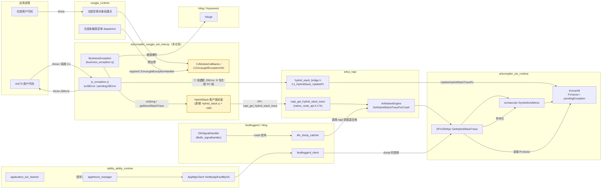
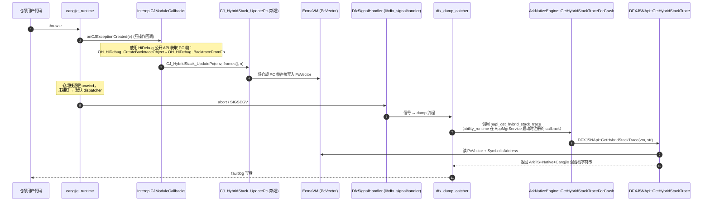
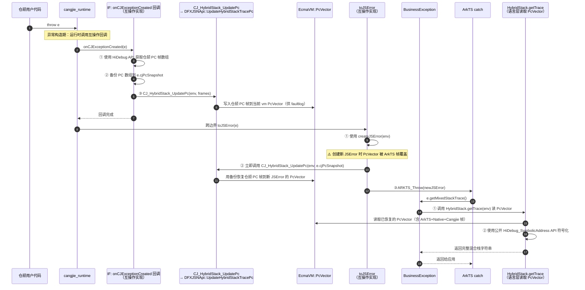

# 混合栈支持仓颉 - 架构设计

> 配套需求文档：[hybridstack_support_cangjie_design.md](./hybridstack_support_cangjie_design.md)
> 适用分支：`feat/hybridstack-redesign`
> 状态：草案 v1（Draft）

## 1. 设计目标对齐

| 优先级 | 目标 | 验证场景 |
| ------ | ---- | -------- |
| P0 (主要) | faultlog 中能稳定显示仓颉栈帧，无论异常源自仓颉侧抛出还是 ArkTS 侧抛出 | 信号触发 crash → faultloggerd 解析出仓颉帧 |
| P1 (次要) | 语言层 `Exception.toString()` 与 `getMixedStackTrace()` 至少呈现「仓颉 + ArkTS」混合栈 | 应用 `try/catch` 后打印异常 |
| P2 (可选) | 语言层混合栈进一步包含 Native (C/C++) 帧 | 同上 |

## 2. 关键约束与重要事实校正

1. **PC Array 单例语义**：`EcmaVM` 上仅保留最近一次 ArkTS Error 创建时刻的 PC 向量，后续任何 Error 创建都会覆盖（参见 `ets_runtime/ecmascript/napi/dfx_jsnapi.cpp:1234` 的 `GetHybridStackTrace`）。
2. **互操作侧当前实现问题 & toJSError 覆盖风险**：`ohos/business_exception/business_exception.cj` 与 `ohos/ark_interop/js_exception.cj` 现状是在 `toJSError()` 边界构造新的 ArkTS Error，覆盖 PC Array。**关键洞察**：`toJSError` 创建新 JSError 时会自动捕获当前 ArkTS 栈并生成新 PcVector，覆盖回调中写入的仓颉帧。本方案采用 **二阶段恢复机制** 策略：
   - **阶段 ①（回调中）**：使用公开 HiDebug API 获取仓颉 PC 帧 → **同时备份到 cjPcSnapshot** → 写入 vm PcVector（供 faultlog）
   - **阶段 ②（toJSError 中立即）**：创建新 JSError（PcVector 被 ArkTS 帧覆盖）→ **立即调用 UpdateHybridStackTracePc(env, cjPcSnapshot) 用备份恢复** → throw
   
   后续 faultlog 和 getMixedStackTrace 直接使用已恢复的 PcVector。该方案支持所有 vm 配置场景（单 VM、多 VM、嵌套 JSRuntime 等），避免跨 VM JSError 转移的绑定问题。详见 [multiruntime_jserror_analysis.md](./multiruntime_jserror_analysis.md)。
3. **不引入仓颉自己抓取 C 栈的能力**：Native 栈仅依赖 ets_runtime / faultloggerd 已有的 `GetHybridStackTrace` 解析能力。
4. **二进制兼容性**：`BusinessException` 类公开 API（`getCrossMessage` / `getMixedStackTrace` / 错误码 34300001-34300008）必须保持兼容。
5. **PC Array 与 toJSError 覆盖风险**：`toJSError` 创建新 JSError 时自动捕获 ArkTS 栈帧并写入 PcVector，会覆盖之前回调中写入的仓颉帧。**二阶段恢复机制**：
   - **①回调中**：使用公开 HiDebug API 获取仓颉 PC → **同时备份到 cjPcSnapshot** → 写入 vm PcVector
   - **②toJSError 中立即**：创建新 JSError（PcVector 被 ArkTS 帧重写） → **立即调用 UpdateHybridStackTracePc(env, cjPcSnapshot) 用备份恢复** → throw
   
   该方案完全避免跨 VM 绑定问题，每个 vm 各自管理自己的 PcVector。
6. **JSEnv 类型与 HiDebug API**：
   - `JSEnv = IntNative`（参见 `ohos/ark_interop/jscontext.cj`），是裸指针值，不是带方法的类。FFI 调用时直接当作 `CPointer<Unit>` 使用。
   - **Cangjie 异常创建期回调**中，使用公开的 HiDebug 栈回溯 API：
     - `OH_HiDebug_CreateBacktraceObject` / `OH_HiDebug_DestroyBacktraceObject`：创建/销毁回溯对象
     - `OH_HiDebug_BacktraceFromFp`：从帧指针获取 PC 帧数组
     - 获取到 PC 帧后调用互操作的 `CJ_HybridStack_UpdatePc(env, frames, count)` 写入当前 vm 的 PcVector
   - **语言层 toString/getMixedStackTrace**中，使用公开的 `OH_HiDebug_SymbolicAddress` 进行符号解析（将 PC 转换为符号信息）。

## 3. 总体架构

### 3.1 周边组件依赖



> 图例：黄色节点为本设计在 `cangjie_ark_interop` 内**新增或重构**的组件；其余为已有外部依赖。

### 3.2 控制流时序

#### 场景 A：仓颉抛出未捕获异常 → faultlog



#### 场景 B：仓颉抛出异常被 ArkTS 捕获并打印



#### 场景 C：ArkTS 抛出异常（无仓颉参与）

不变更现有路径：ArkTS 自身的 `JSError` 创建已经写入 PcVector，faultlog 直接由 ets_runtime 输出，互操作侧零参与。

## 4. 模块设计

### 4.1 仓库内目录规划

```
arkcompiler_cangjie_ark_interop/
├── doc/
│   ├── hybridstack_support_cangjie_design.md    # 需求文档（已存在）
│   └── hybridstack_architecture_design.md       # 本文件
├── ohos/
│   ├── ark_interop/
│   │   ├── js_exception.cj            # 重构：toJSError 不再 createJSError（主路径）
│   │   └── js_module.cj               # 重构：注册“异常构造期回调”
│   ├── business_exception/
│   │   └── business_exception.cj      # 重构：toString/getMixedStackTrace 调用 HybridStack
│   └── hybrid_stack/                  # 新增子模块
│       ├── hybrid_stack.cj            # 仓颉侧 API 封装
│       └── hybrid_stack_ffi.cj        # @C foreign 声明
├── frameworks/native/hybrid_stack/    # 新增 C++ 桥接
│   ├── hybrid_stack_bridge.cpp
│   ├── hybrid_stack_bridge.h
│   └── BUILD.gn
├── interfaces/inner_api/hybrid_stack/ # 对外暴露给 ability_runtime（可选）
│   └── hybrid_stack_inner.h
└── test/
    └── hybridstack/                   # 单测 + 端到端验证脚本
```

### 4.2 关键接口

#### 4.2.1 C 桥接（新增 `frameworks/native/hybrid_stack/hybrid_stack_bridge.h`）

```cpp
// 被仓颉侧通过 @C foreign 调用，获取混合栈信息（语言层路径）
extern "C" int CJ_HybridStack_GetTrace(napi_env env,
                                       char* buf,
                                       size_t bufLen,
                                       size_t* outLen);

// faultlog 路径：将仓颉 backtrace PC 帧直接写入当前 vm 的 PcVector。
// frames: void* 指针数组（每个元素为 PC 地址）；count: 数组长度。
// 返回 0 = 成功；-1 = 参数非法；-2 = 上游接口不可用。
extern "C" int CJ_HybridStack_UpdatePc(napi_env env,
                                       void** frames,
                                       int count);
```

实现内部转调：
- `CJ_HybridStack_GetTrace` → `napi_get_hybrid_stack_trace`（语言层获取混合栈）
- `CJ_HybridStack_UpdatePc` → `DFXJSNApi::UpdateHybridStackTracePc(vm, frames, count)`（写 PcVector）

#### 4.2.2 仓颉侧 API（新增 `ohos/hybrid_stack/hybrid_stack.cj`）

```cangjie
public class HybridStack {
    // 获取混合栈信息（语言层 toString/getMixedStackTrace 调用）
    public static func getTrace(env: JSEnv): String { ... }
}
```

#### 4.2.3 重构点

| 文件 | 现状 | 改动（二阶段恢复机制） |
| ---- | ---- | ---- |
| `ohos/ark_interop/js_module.cj` 互操作回调 | 不存在或未实现 | **新增回调 onCJExceptionCreated**（由仓颉运行时在异常创建时调用）：① 使用 HiDebug API 获取 PC 帧 ② 备份到 cjPcSnapshot ③ **直接调用** `CJ_HybridStack_UpdatePc(env, frames)` 写入当前 vm PcVector（供 faultlog）。 |
| `ohos/ark_interop/js_exception.cj:145-165 toJSError` | 每次跨边界都创建 ArkTS Error | **互操作实现改造**：① `createJSError()` 创建新 JSError（自动绑定当前 vm）② **立即调用** `CJ_HybridStack_UpdatePc(env, cjPcSnapshot)` 恢复 PcVector ③ `ARKTS_Throw()` 抛出。 |
| `ohos/business_exception/business_exception.cj` getMixedStackTrace | 自行拼接字符串 | **重构**：调用 `HybridStack.getTrace(env)` 读已恢复的 PcVector → 用公开 HiDebug API 符号解析 → 输出完整栈。缓存结果到 `cachedHybridTrace: ?String`。 |
| `ohos/ark_interop/js_exception.cj` 缓存机制 | 无 | 新增字段 `SharedException.cjPcSnapshot: ?Array<UIntNative>`，在回调中填充，供 toJSError 恢复使用。 |
| `ohos/ark_interop/js_exception.cj` 缓存机制 | 无 | 新增字段：`SharedException.cjPcSnapshot: ?Array<UIntNative>` 存储仓颉帧 PC 快照。在回调中填充，供 toJSError 中恢复使用。 |

#### 4.2.4 互操作回调与上游 API（上游新增 1 个 API）

本设计采用 **"异常创建期回调 → 互操作调用 UpdatePc 写入 PcVector"** 的策略。运行时侧无需调用互操作任何接口，仅需提供一个内部 API 供互操作调用。

**上游新增接口**（ets_runtime 内部使用）：

```c
// 将 Cangjie backtrace 的 PC 帧直接写入指定 vm 的 PcVector
// 参数：vm 实例指针，data 为 PC 指针数组，size 为数组大小
void DFXJSNApi::UpdateHybridStackTracePc(const EcmaVM *vm, void** data, int size);
```

**运行时的角色**：

仓颉运行时（cangjie_runtime）在异常对象构造时，调用互操作注册的回调 `onCJExceptionCreated`。该回调由互操作侧实现，负责：
1. 使用公开 HiDebug API 获取仓颉 PC 帧
2. 备份到异常对象的 `cjPcSnapshot` 字段
3. **调用 UpdateHybridStackTracePc 将 PC 写入当前 vm 的 PcVector**

运行时本身**不需要知道 UpdateHybridStackTracePc 的存在**；它只负责调用回调。

**互操作的角色**：

互操作在两个地方使用 UpdateHybridStackTracePc：

1. **回调 onCJExceptionCreated 中**（由运行时自动触发）：
   - 获取 PC 帧 → 备份 → 调用 UpdateHybridStackTracePc 写 PcVector
   
2. **toJSError 实现中**（语言层调用 toJSError 时触发）：
   - 创建新 JSError → 立即调用 UpdateHybridStackTracePc 恢复 cjPcSnapshot

**调用时序**：

| 阶段 | 调用者 | 被调用方 | 操作 |
| ---- | ---- | ---- | ---- |
| ①异常创建期 | cangjie_runtime | 互操作回调 onCJExceptionCreated | 获取 PC、备份、**调用 UpdateHybridStackTracePc 写 PcVector** |
| ②toJSError | 互操作 toJSError | 互操作内部 / UpdateHybridStackTracePc | 恢复 **PcVector**（从 cjPcSnapshot） |
| ③语言层 toString | 语言层代码 | HybridStack.getTrace | **读** PcVector、符号化（不调用 UpdatePc） |

**场景说明**：

| 场景 | 处理流程 |
| ---- | ---- |
| 未捕获异常 faultlog（场景 A） | ① 仓颉运行时异常创建时调用互操作回调 ② 回调使用 HiDebug 获取 PC ③ 回调调用 UpdateHybridStackTracePc 写 PcVector ④ 异常未捕获 → 进程崩溃 ⑤ dfx_dump_catcher 调用 DFXJSNApi::GetHybridStackTrace 读已更新的 PcVector → faultlog 输出完整混合栈 |
| 跨边界 toJSError（场景 B） | ① 回调阶段已完成（同上） ② 互操作的 toJSError 实现中创建新 JSError（PcVector 被覆盖） ③ toJSError 立即调用 UpdateHybridStackTracePc 恢复 ④ throw ⑤ 语言层 getMixedStackTrace 调用 HybridStack.getTrace → 读已恢复的 PcVector → 符号化输出 |
| 多 worker 场景 | 每个 worker 的仓颉运行时独立；各回调各自调用 UpdateHybridStackTracePc 更新各自 vm 的 PcVector；toJSError 各自恢复各自 vm；无串联 |

> **优势**：
> - ✓ **运行时侧无需知道互操作的任何实现细节**，仅调用标准回调接口
> - ✓ **完全避免 JSError vm address 绑定问题**（每个 vm 独立处理）
> - ✓ 统一代码路径，无复杂的检测与降级逻辑
> - ✓ **上游仅需 1 个内部 API**（UpdateHybridStackTracePc），对外完全透明
> - ✓ **客户端 PC 获取都用公开 HiDebug API**，无依赖私有实现
> - ✓ 支持所有 vm 配置（单 VM、多 VM、嵌套 JSRuntime）

> **上游依赖**：ets_runtime 仅需在 DFXJSNApi 中新增 UpdateHybridStackTracePc 接口。若无法接受，回退至仅语言层（P1/P2），faultlog 能力不完整。

> **优势**：
> - ✓ 完全避免 JSError vm address 绑定问题（每个 vm 独立处理，恢复在当前 vm 中）
> - ✓ 统一代码路径，无复杂的检测与降级逻辑
> - ✓ **上游仅需 1 个接口**（UpdateHybridStackTracePc），协作成本极低
> - ✓ **客户端 PC 获取都用公开 HiDebug API**，无依赖私有实现
> - ✓ 支持所有 vm 配置（单 VM、多 VM、嵌套 JSRuntime）
> - ✓ **toJSError 中立即恢复**，无后续路径复杂性，PcVector 始终有效

> **上游依赖**：ets_runtime 仅需提供 `DFXJSNApi::UpdateHybridStackTracePc`。若无法接受，回退至仅语言层（P1/P2），faultlog 能力不完整。

## 5. 性能与可优化空间

| 项 | 描述 | 状态 |
| -- | ---- | ---- |
| **符号化结果缓存** | 语言层 `getMixedStackTrace` 解析后缓存到 `BusinessException` 实例字段 `cachedHybridTrace: ?String`；faultlog 路径获取同一 vmAddr 的结果时，在 C++ 桥接层额外增一层 `static thread_local std::unordered_map<uint64_t, std::string>` 缓存，赋值于 `napi_get_hybrid_stack_trace` 之后。Plan **Task 5b** 为实现优化。 | v1 提供实例字段，thread_local 缓存作为选项任务 |
| **PcVector 写入成本** | 仅在 wrapper 创建场景调用，O(n) n=PcVector size，估计 < 1KB | 启用 |
| **跨语言 FFI 调用** | `CJ_HybridStack_GetTrace` 仅在异常路径触发，频次低 | 启用 |

## 6. 兼容性 / 风险与 PC API 方案的安全性

1. **PcVector 写接口的上游依赖**：`DFXJSNApi::UpdateHybridStackTracePc` 必须落地到 ets_runtime。Plan Task 1 spike 决定上游接受度；若拒绝，启用语言层降级（P1/P2），faultlog 能力不完整。**相比旧方案的 3 个接口，上游上沉本更低。**

2. **多 VM 安全性（PC API 方案的优势）**：
   - 每个 `toJSError` 调用时都创建**新的** JSError，该 JSError 自动绑定到当前执行的 vm。
   - 恢复 PcVector 操作只作用于当前 vm，不涉及跨 vm 对象转移。
   - 完全避免「预创建方案」中的 vm address mismatch 问题（参见 [multiruntime_jserror_analysis.md](./multiruntime_jserror_analysis.md)）。
   - 支持嵌套 JSRuntime、worker 隔离等所有场景。

3. **缓存机制（Cangjie PC 快照存储）**：
   - 在 `SharedException` 中新增 `cjPcSnapshot: ?Array<UIntNative>` 字段，在仓颉异常对象创建时自动填充（读取 backtrace）。
   - `toJSError` 读取该字段传入 `CJ_HybridStack_UpdatePc`；若缺失则 PcVector 保持初始值（ArkTS-only）。
   - 无需预创建 JSError，无需 vm 地址匹配检查。

4. **多 worker 线程安全**：
   - 每个 worker 独立的 EcmaVM + PcVector；`ALL_RUNTIMES_` map（`jscontext.cj`）按 `vmAddr` 索引，访问点已在仓颉侧 `synchronized`。
   - `CJ_HybridStack_UpdatePc` 调用前需锁住对应 `JSContext`；C++ 侧实现通过 `napi_env` 自动定位正确 vm。

5. **异常对象字段扩展**：
   - 新增 `SharedException.cjPcSnapshot: ?Array<UIntNative>` 存储仓颉帧 PC 快照。
   - 新增 `SharedException.fromInteropBoundary: Bool` 标记是否为互操作内部生成的 wrapper（可选，用于加强类型安全）。

6. **API Level**：新增仓颉 API 需打 `@APILevel` 装饰器（参考 `ohos/labels/api_level.cj`）。

## 7. 端到端验证策略

| 验证 | 方式 | 工具 |
| ---- | ---- | ---- |
| 单元 | `test/hybridstack/` 下 `cjpm test` | `.agents/skills/cjpm-build` |
| 集成构建 | 替换兼容 SDK 产物后 hvigor 打包 VerifyBuild | `.agents/skills/verifybuild-e2e-validation` |
| Faultlog 现场 | 设备 hilog + faultlog 抓取，确认仓颉 PC 出现在 `=====Hybrid Stack=====` 段 | 手工 |
| 语言层 | `try{ ... } catch(e){ console.error(e.toString()) }` 输出包含三段：CJ frames / ArkTS frames / Native frames | 手工 + 单测 |

## 8. 与历史方案的差异

| 维度 | 旧 stitching 方案（`feat/mixed-exception-stack-stitching`） | 本设计（PC API 方案） |
| ---- | --------------------------------------------------------- | ------ |
| Faultlog 仓颉栈来源 | 互操作侧自行 stitch 字符串注入 faultlog | 复用 ets_runtime PcVector + DFXJSNApi 已有路径，通过恢复 PC 避免覆盖 |
| ArkTS Wrapper 与 PC 覆盖 | 未处理，依赖 stitching 弥补 | 在 `toJSError` 中创建新 JSError（自动绑定当前 vm），再恢复 Cangjie PC 到 PcVector；支持嵌套 JSRuntime |
| 语言层混合栈 | 字符串拼接 | 调用 `napi_get_hybrid_stack_trace` 统一来源 |
| 多 VM 支持 | 无考虑 | ✓ 完全支持（PC API 方案的核心优势） |
| 对仓颉运行时依赖 | 强（自带 HiDebug backtrace 抓取） | 弱（仅需异常对象记录本地 backtrace，无需回调） |
| 上游协作面 | 仓颉运行时 + interop | ets_runtime (`DFXJSNApi` **+1 API**）+ interop |

## 9. 后续工作

1. 与 ets_runtime owner 对齐 `DFXJSNApi::UpdateHybridStackTracePc` 接口（**仅 1 个**）。
2. 实施 plan：[`docs/superpowers/plans/2026-04-24-hybridstack-redesign.md`](../docs/superpowers/plans/2026-04-24-hybridstack-redesign.md)
