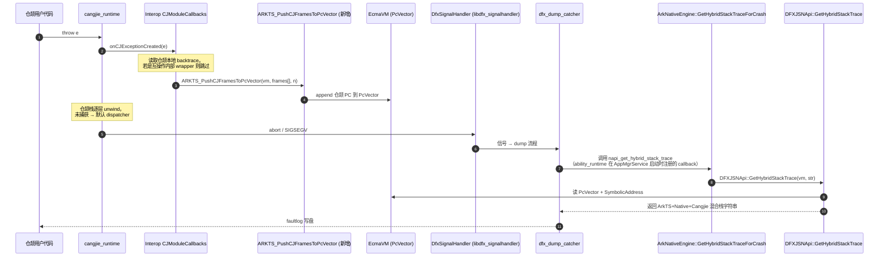
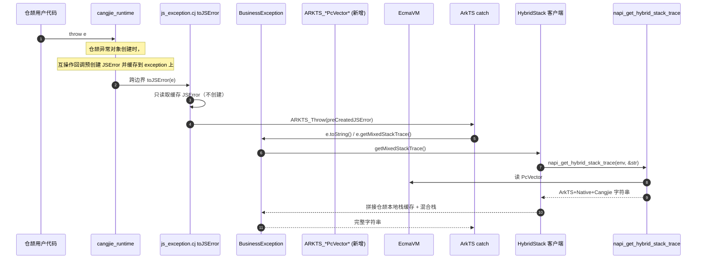

# 混合栈支持仓颉 - 架构设计

> 配套需求文档：[hybridstack_support_cangjie_design.md](./hybridstack_support_cangjie_design.md)
> 适用分支：`feat/hybridstack-redesign`
> 状态：草案 v1（Draft）

## 1. 设计目标对齐

| 优先级 | 目标 | 验证场景 |
| ------ | ---- | -------- |
| P0 (主要) | faultlog 中能稳定显示仓颉栈帧，无论异常源自仓颉侧抛出还是 ArkTS 侧抛出 | 信号触发 crash → faultloggerd 解析出仓颉帧 |
| P1 (次要) | 语言层 `Exception.toString()` 与 `getMixedStackTrace()` 至少呈现「仓颉 + ArkTS」混合栈 | 应用 `try/catch` 后打印异常 |
| P2 (可选) | 语言层混合栈进一步包含 Native (C/C++) 帧 | 同上 |

## 2. 关键约束与重要事实校正

1. **PC Array 单例语义**：`EcmaVM` 上仅保留最近一次 ArkTS Error 创建时刻的 PC 向量，后续任何 Error 创建都会覆盖（参见 `ets_runtime/ecmascript/napi/dfx_jsnapi.cpp:1234` 的 `GetHybridStackTrace`）。
2. **互操作侧当前实现问题**：`ohos/business_exception/business_exception.cj` 与 `ohos/ark_interop/js_exception.cj` 现状是在 `toJSError()` 边界构造新的 ArkTS Error，覆盖 PC Array，是当前 faultlog 丢失仓颉帧的根因。本方案采用 **PC 指针更新 API** 方案：在 `toJSError` 中创建新 JSError（自动绑定当前 vm），通过 `ARKTS_RestorePcVectorSnapshot` 恢复 Cangjie 帧的 PC 集合到新 JSError 的 PcVector。该方案支持所有 vm 配置场景（单 VM、多 VM、嵌套 JSRuntime 等），避免跨 VM JSError 转移的绑定问题。详见 [multiruntime_jserror_analysis.md](./multiruntime_jserror_analysis.md)。
3. **不引入仓颉自己抓取 C 栈的能力**：Native 栈仅依赖 ets_runtime / faultloggerd 已有的 `GetHybridStackTrace` 解析能力。
4. **二进制兼容性**：`BusinessException` 类公开 API（`getCrossMessage` / `getMixedStackTrace` / 错误码 34300001-34300008）必须保持兼容。
5. **PC Array 与跨 VM 问题**：`ARKTS_UpdateStackInfo(opKind)` 仅切换 fiber 栈上下文，不能写 PcVector。JSError 在创建时自动绑定到特定 EcmaVM 实例。若使用预创建方案（vm_A 中创建 JSError），当该 JSError 被 throw 到另一个 vm_B（例如嵌套 JSRuntime）时，会产生 vm address mismatch，导致符号化失败或新 Error 创建覆盖 PcVector。本方案改为：**统一采用 PC 快照/恢复 API** — 每次 `toJSError` 创建新 JSError（自动绑定当前 vm），再通过 `ARKTS_GetPcVectorSnapshot/RestorePcVectorSnapshot` 手动转移 Cangjie PC 帧。新增 3 个 cjffi 接口见 §4.2.4，无需新增上游 opKind。
6. **JSEnv 类型**：`JSEnv = IntNative`（参见 `ohos/ark_interop/jscontext.cj`），是裸指针值，不是带方法的类。FFI 调用时直接当作 `CPointer<Unit>` 使用，避免出现「`env.rawPointer()`」之类的伪 API。

## 3. 总体架构

### 3.1 周边组件依赖

```mermaid
flowchart LR
    subgraph App[应用进程]
        direction TB
        CJApp["仓颉用户代码"]
        ETSApp["ArkTS 用户代码"]
    end

    subgraph CJRT[cangjie_runtime]
        CJExc["仓颉异常对象创建点"]
        CJUnc["仓颉未捕获异常 dispatcher"]
    end

    subgraph Interop[arkcompiler_cangjie_ark_interop（本仓库）]
        direction TB
        IFCallbacks["CJModuleCallbacks /<br/>CJUncaughtExceptionInfo"]
        BizExc["BusinessException<br/>(business_exception.cj)"]
        JsExc["js_exception.cj<br/>toJSError / pendingJSError"]
        HybridApi["HybridStack 客户端封装<br/>(新增: hybrid_stack.cj + .cpp)"]
    end

    subgraph Napi[arkui_napi]
        CJFFI[\"cjffi/ark_interop_napi.h<br/>ARKTS_GetPcVectorSnapshot /<br/>ARKTS_RestorePcVectorSnapshot\"]
        NapiHS["napi_get_hybrid_stack_trace<br/>(native_node_api.h:174)"]
        ArkEng["ArkNativeEngine<br/>GetHybridStackTraceForCrash"]
    end

    subgraph EtsRT[arkcompiler_ets_runtime]
        VM["EcmaVM<br/>PcVector / pendingException"]
        Dfx["DFXJSNApi::GetHybridStackTrace"]
        Sym["ecmascript::SymbolicAddress"]
    end

    subgraph Ability[ability_ability_runtime]
        AnrL["application_anr_listener"]
        Freeze["appfreeze_manager"]
        AppMgr["AppMgrClient::NotifyAppFaultBySA"]
    end

    subgraph FaultL[faultloggerd / hilog]
        FltClient["faultloggerd_client"]
        DumpCatcher["dfx_dump_catcher"]
        SigHandler["DfxSignalHandler<br/>(libdfx_signalhandler)"]
    end

    subgraph HiLog[hilog / hisysevent]
        HiLogD["hilogd"]
    end

    CJApp -->|throw| CJExc
    ETSApp -->|throw / 调用 CJ| JsExc

    CJExc -->|跨边界| IFCallbacks
    IFCallbacks -->|记录 Cangjie PC 快照| CJFFI

    JsExc -->|创建新 JSError + 恢复 PC + throw| ETSApp

    BizExc -->|toString / getMixedStackTrace| HybridApi
    HybridApi -->|FFI: napi_get_hybrid_stack_trace| NapiHS
    NapiHS --> ArkEng --> Dfx --> Sym --> VM

    CJUnc -->|registerCJUncaughtExceptionHandler| IFCallbacks

    Ability -->|信号 / ANR| Freeze
    Freeze --> AppMgr --> FltClient
    SigHandler -->|crash 信号| DumpCatcher
    DumpCatcher -->|调用 napi 获取混合栈| ArkEng
    FltClient -->|dump 时调用| Dfx
    Dfx -->|读取 PcVector| VM
    Dfx -->|符号化| Sym
    BizExc -->|错误事件| HiLogD

    classDef new fill:#fff5cc,stroke:#d4a017,stroke-width:2px;
    class HybridApi,IFCallbacks new
```

> 图例：黄色节点为本设计在 `cangjie_ark_interop` 内**新增或重构**的组件；其余为已有外部依赖。

### 3.2 控制流时序

#### 场景 A：仓颉抛出未捕获异常 → faultlog



#### 场景 B：仓颉抛出异常被 ArkTS 捕获并打印



#### 场景 C：ArkTS 抛出异常（无仓颉参与）

不变更现有路径：ArkTS 自身的 `JSError` 创建已经写入 PcVector，faultlog 直接由 ets_runtime 输出，互操作侧零参与。

## 4. 模块设计

### 4.1 仓库内目录规划

```
arkcompiler_cangjie_ark_interop/
├── doc/
│   ├── hybridstack_support_cangjie_design.md    # 需求文档（已存在）
│   └── hybridstack_architecture_design.md       # 本文件
├── ohos/
│   ├── ark_interop/
│   │   ├── js_exception.cj            # 重构：toJSError 不再 createJSError（主路径）
│   │   └── js_module.cj               # 重构：注册“异常构造期回调”
│   ├── business_exception/
│   │   └── business_exception.cj      # 重构：toString/getMixedStackTrace 调用 HybridStack
│   └── hybrid_stack/                  # 新增子模块
│       ├── hybrid_stack.cj            # 仓颉侧 API 封装
│       └── hybrid_stack_ffi.cj        # @C foreign 声明
├── frameworks/native/hybrid_stack/    # 新增 C++ 桥接
│   ├── hybrid_stack_bridge.cpp
│   ├── hybrid_stack_bridge.h
│   └── BUILD.gn
├── interfaces/inner_api/hybrid_stack/ # 对外暴露给 ability_runtime（可选）
│   └── hybrid_stack_inner.h
└── test/
    └── hybridstack/                   # 单测 + 端到端验证脚本
```

### 4.2 关键接口

#### 4.2.1 C 桥接（新增 `frameworks/native/hybrid_stack/hybrid_stack_bridge.h`）

```cpp
// 被仓颉侧通过 @C foreign 调用，获取混合栈信息（语言层路径）
extern "C" int CJ_HybridStack_GetTrace(napi_env env,
                                       char* buf,
                                       size_t bufLen,
                                       size_t* outLen);

// 获取 PcVector 快照
extern "C" int CJ_HybridStack_GetPcVectorSnapshot(unsigned long long vmAddr,
                                                  uintptr_t** outFrames,
                                                  size_t* outCount);

// 恢复 PcVector（覆盖写）
extern "C" int CJ_HybridStack_RestorePcVector(unsigned long long vmAddr,
                                              const uintptr_t* frames,
                                              size_t count);
```

实现内部转调：
- `CJ_HybridStack_GetTrace` → `napi_get_hybrid_stack_trace`（语言层获取混合栈）
- `CJ_HybridStack_GetPcVectorSnapshot` → `ARKTS_GetPcVectorSnapshot`（读 PcVector）
- `CJ_HybridStack_RestorePcVector` → `ARKTS_RestorePcVectorSnapshot`（写 PcVector）

#### 4.2.2 仓颉侧 API（新增 `ohos/hybrid_stack/hybrid_stack.cj`）

```cangjie
public class HybridStack {
    // 获取混合栈信息（语言层 toString/getMixedStackTrace 调用）
    public static func getTrace(env: JSEnv): String { ... }
}
```

#### 4.2.3 重构点

| 文件 | 现状 | 改动（PC API 统一方案） |
| ---- | ---- | ---- |
| `ohos/ark_interop/js_exception.cj:145-165 toJSError` | 每次跨边界都创建 ArkTS Error，覆盖 PcVector | **主路径**：① 创建新 JSError（自动绑定当前 vm）② 从 Cangjie 异常对象读取 PC 快照 ③ 调用 `CJ_HybridStack_RestorePcVector` 将快照写入新 JSError 的 PcVector ④ throw 新 JSError。完全支持嵌套 JSRuntime 等多 VM 场景。 |
| `ohos/ark_interop/js_exception.cj` 缓存机制 | 无 | 新增字段：`SharedException.cjPcSnapshot: ?Array<UIntNative>` 存储仓颉帧 PC 快照，由 Cangjie 侧在异常入站时填充。`toJSError` 读取该字段。 |
| `ohos/business_exception/business_exception.cj:152-178 getMixedStackTrace` | 自行拼接仓颉 + ArkTS 字符串 | 调用 `HybridStack.getTrace(env)` 获取 ArkTS+Native+Cangjie 完整混合栈字符串，与本地仓颉帧缓存合并去重后返回。 |

#### 4.2.4 PC 指针更新接口（新增 cjffi C API）

本设计采用 **\"创建本地 JSError + 手动恢复 PcVector\"** 的策略，避免跨 VM JSError 绑定问题。新增 3 个 cjffi 接口：

1. **获取 PcVector 快照**
   - `ARKTS_GetPcVectorSnapshot(vmAddr, *outFrames, *outCount)`：读 `vm->GetPcVectorData()` / `GetPcVectorSize()` 并返回指针+大小。
   - 实现位置：`arkui_napi/native_engine/impl/ark/ark_native_engine.cpp` 暴露；底层调用 `ets_runtime` 的 `JSNApi` 访问 vm 内部 PcVector。

2. **恢复 PcVector**
   - `ARKTS_RestorePcVectorSnapshot(vmAddr, *frames, frameCount)`：将 frames 数组完全覆盖写回 vm 的 PcVector 字段。
   - 需要 `ets_runtime` 新增内部接口 `JSNApi::SetPcVector(vm, data, size)`。

3. **追加 PcVector**（可选，用于语言层 stitched 情景）
   - `ARKTS_AppendPcVector(vmAddr, *frames, frameCount)`：将 frames 数组追加到现有 PcVector 末尾。
   - 同样需要 `ets_runtime` 新增 `JSNApi::AppendPcVector(vm, data, size)`。

4. **使用模式**（PC API 统一方案）：

| 场景 | 处理 |
| ---- | ---- |
| 跨边界 `toJSError`（场景 B 主路径） | ① 读取 Cangjie 异常对象中缓存的 PC 快照 ② 创建新 JSError（自动绑定当前 vm，PcVector 为当前 ArkTS 帧）③ 调用 `ARKTS_RestorePcVectorSnapshot` 覆盖 PcVector ④ throw 新 JSError。支持任意 vm 配置，包括嵌套 JSRuntime。 |
| 未捕获异常 faultlog（场景 A） | 同上：toJSError 执行时恢复 PcVector，后续 DFXJSNApi::GetHybridStackTrace 读取已包含 Cangjie 帧的 PcVector。 |
| 多 worker 场景 | 每个 worker 有独立 vm + PcVector，恢复操作针对当前 vm，无跨 vm 冲突。 |

> **优势**：完全避免 JSError vm address 绑定问题；单一代码路径，易测试；支持所有 vm 配置。
> **依赖**：ets_runtime 必须提供 `SetPcVector/AppendPcVector` 内部接口。若上游无法接受，则仅支持语言层（P1/P2），faultlog 回退至旧方案（stitched 文本）。

## 5. 性能与可优化空间

| 项 | 描述 | 状态 |
| -- | ---- | ---- |
| **符号化结果缓存** | 语言层 `getMixedStackTrace` 解析后缓存到 `BusinessException` 实例字段 `cachedHybridTrace: ?String`；faultlog 路径获取同一 vmAddr 的结果时，在 C++ 桥接层额外增一层 `static thread_local std::unordered_map<uint64_t, std::string>` 缓存，赋值于 `napi_get_hybrid_stack_trace` 之后。Plan **Task 5b** 为实现优化。 | v1 提供实例字段，thread_local 缓存作为选项任务 |
| **PcVector 快照成本** | 仅在 wrapper 创建场景调用，O(n) n=PcVector size，估计 < 1KB | 启用 |
| **跨语言 FFI 调用** | `CJ_HybridStack_GetTrace` 仅在异常路径触发，频次低 | 启用 |

## 6. 兼容性 / 风险与 PC API 方案的安全性

1. **PcVector 读写接口的上游依赖**：`SetPcVector/AppendPcVector` 必须落地到 ets_runtime + arkui_napi。Plan Task 1 spike 决定上游接受度；若拒绝，启用语言层降级（P1/P2），faultlog 能力不完整。

2. **多 VM 安全性（PC API 方案的优势）**：
   - 每个 `toJSError` 调用时都创建**新的** JSError，该 JSError 自动绑定到当前执行的 vm。
   - 恢复 PcVector 操作只作用于当前 vm，不涉及跨 vm 对象转移。
   - 完全避免「预创建方案」中的 vm address mismatch 问题（参见 [multiruntime_jserror_analysis.md](./multiruntime_jserror_analysis.md)）。
   - 支持嵌套 JSRuntime、worker 隔离等所有场景。

3. **缓存机制（Cangjie PC 快照存储）**：
   - 在 `SharedException` 中新增 `cjPcSnapshot: ?Array<UIntNative>` 字段，在跨边界前（`toJSError` 入口）由仓颉侧填充。
   - 恢复时从该字段读取，若缺失则 PcVector 保留初始值（ArkTS-only）。
   - 无需预创建 JSError，无需 vm 地址匹配检查。

4. **多 worker 线程安全**：
   - 每个 worker 独立的 EcmaVM + PcVector；`ALL_RUNTIMES_` map（`jscontext.cj`）按 `vmAddr` 索引，访问点已在仓颉侧 `synchronized`。
   - `ARKTS_RestorePcVectorSnapshot` 调用前需锁住对应 `JSContext`；C++ 侧实现使用 `JSNApi::EnterEnv` 切换正确 vm。

5. **异常对象字段扩展**：
   - 新增 `SharedException.cjPcSnapshot: ?Array<UIntNative>` 存储仓颉帧 PC 快照。
   - 新增 `SharedException.fromInteropBoundary: Bool` 标记是否为互操作内部生成的 wrapper（可选，用于加强类型安全）。

6. **API Level**：新增仓颉 API 需打 `@APILevel` 装饰器（参考 `ohos/labels/api_level.cj`）。

## 7. 端到端验证策略

| 验证 | 方式 | 工具 |
| ---- | ---- | ---- |
| 单元 | `test/hybridstack/` 下 `cjpm test` | `.agents/skills/cjpm-build` |
| 集成构建 | 替换兼容 SDK 产物后 hvigor 打包 VerifyBuild | `.agents/skills/verifybuild-e2e-validation` |
| Faultlog 现场 | 设备 hilog + faultlog 抓取，确认仓颉 PC 出现在 `=====Hybrid Stack=====` 段 | 手工 |
| 语言层 | `try{ ... } catch(e){ console.error(e.toString()) }` 输出包含三段：CJ frames / ArkTS frames / Native frames | 手工 + 单测 |

## 8. 与历史方案的差异

| 维度 | 旧 stitching 方案（`feat/mixed-exception-stack-stitching`） | 本设计（PC API 方案） |
| ---- | --------------------------------------------------------- | ------ |
| Faultlog 仓颉栈来源 | 互操作侧自行 stitch 字符串注入 faultlog | 复用 ets_runtime PcVector + DFXJSNApi 已有路径，通过恢复 PC 避免覆盖 |
| ArkTS Wrapper 与 PC 覆盖 | 未处理，依赖 stitching 弥补 | 在 `toJSError` 中创建新 JSError（自动绑定当前 vm），再恢复 Cangjie PC 到 PcVector；支持嵌套 JSRuntime |
| 语言层混合栈 | 字符串拼接 | 调用 `napi_get_hybrid_stack_trace` 统一来源 |
| 多 VM 支持 | 无考虑 | ✓ 完全支持（PC API 方案的核心优势） |
| 对仓颉运行时依赖 | 强（自带 HiDebug backtrace 抓取） | 弱（仅需异常对象记录本地 backtrace，无需回调） |
| 上游协作面 | 仓颉运行时 + interop | ets_runtime (`SetPcVector`) + arkui_napi（cjffi 包装）+ interop |

## 9. 后续工作

1. 与 ets_runtime / arkui_napi owner 对齐 `GetPcVectorSnapshot`、`SetPcVector`、`AppendPcVector` 接口。
2. 实施 plan：[`docs/superpowers/plans/2026-04-24-hybridstack-redesign.md`](../docs/superpowers/plans/2026-04-24-hybridstack-redesign.md)
